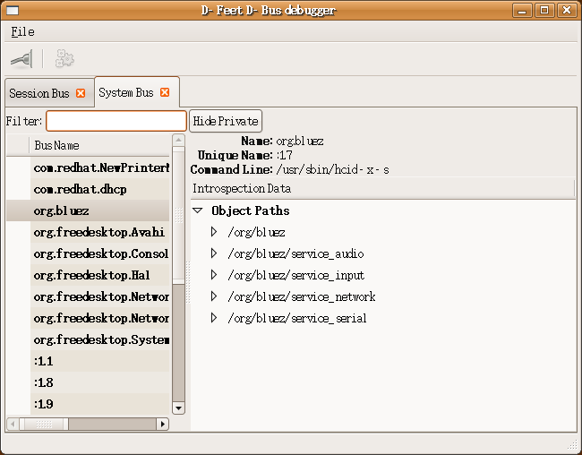
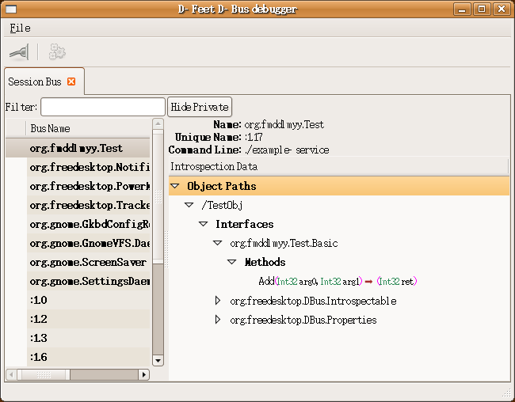

[TOC]
<center><b>dbus实例讲解</b></center>
<center> -- <a href="http://www.fmddlmyy.cn/">fmddlmyy</a></center>

# 一：初次见面

网上有不少介绍 dbus 的文章。本文的目标是补充一些简单的例子。

## 1、dbus是什么东西？

网上有一篇叫“[D-Bus Tutorial](http://dbus.freedesktop.org/doc/dbus-tutorial.html)”的文章，流传较广。不少介绍dbus的资料，都引用了其中的段落。 其实相对于这篇文章，我建议大家直接读“[D-Bus Specification](http://dbus.freedesktop.org/doc/dbus-specification.html)”，篇幅不算长， 文字也不算枯燥。

D-Bus是针对桌面环境优化的IPC（interprocess communication ）机制，用于进程间的通信或进程与内核的通信。最基本的D-Bus协议是一对一的通信协议。 但在很多情况下，通信的一方是消息总线。消息总线是一个特殊的应用，它同时与多个应用通信，并在应用之间传递消息。下面我们会在实例中观察消息总线的作用。 消息总线的角色有点类似与X系统中的窗口管理器，窗口管理器既是X客户，又负责管理窗口。

支持dbus的系统都有两个标准的消息总线：系统总线和会话总线。系统总线用于系统与应用的通信。会话总线用于应用之间的通信。 网上有一个叫d-feet的python程序，我们可以用它来观察系统中的dbus世界。



D-Bus是一个程序。它提供了API。但我们一般不会直接使用dbus的接口。dbus-glib是GTK版本的dbus接口封装。 本文假设读者安装了dbus-glib，我安装的是dbus-glib-0.76。后面还会看到，通过python操纵dbus是多么简单。

## 2、D-Bus的基本概念

### 2.1、从例子开始

我写了一个最简单的dbus服务器，它通过dbus提供了一个加法的接口。 大家可以[下载](hello-dbus3-0.1.tar.gz)这个例子。这是一个autotool工程，大家解包后，执行：
```bash
./autogen.sh
./configure
make
```
然后在src目录运行：
```bash
./example-service
```
这时再运行d-feet，连接session bus，在“Bus Name”窗口会看到一个叫“org.fmddlmyy.Test”连接名。



在Parameters窗口输入“1,2”，点击“Execute”按钮，然后在“Output”窗口我们看到了输出结果。我们刚刚创建了一个dbus服务并调用了它。

### 2.2、名词

我们来解释一下d-feet中出现的名词。

#### 2.2.1、Bus Name

可以把Bus Name理解为连接的名称，一个Bus Name总是代表一个应用和消息总线的连接。 有两种作用不同的Bus Name，一个叫公共名（well-known names），还有一个叫唯一名（Unique Connection Name）。

##### 2.2.1.1、可能有多个备选连接的公共名

公共名提供众所周知的服务。其他应用通过这个名称来使用名称对应的服务。可能有多个连接要求提供同个公共名的服务，即多个应用连接到消息总线，要求提供同个公共名的服务。 消息总线会把这些连接排在链表中，并选择一个连接提供公共名代表的服务。可以说这个提供服务的连接拥有了这个公共名。 如果这个连接退出了，消息总线会从链表中选择下一个连接提供服务。公共名是由一些圆点分隔的多个小写标志符组成的，例如“org.fmddlmyy.Test”、“org.bluez”。

##### 2.2.1.2、每个连接都有一个唯一名

当应用连接到消息总线时，消息总线会给每个应用分配一个唯一名。唯一名以“:”开头，“:”后面通常是圆点分隔的两个数字，例如“:1.0”。 每个连接都有一个唯一名。在一个消息总线的生命期内，不会有两个连接有相同的唯一名。 拥有公众名的连接同样有唯一名，例如在前面的图中，“org.fmddlmyy.Test”的唯一名是“:1.17”。

有的连接只有唯一名，没有公众名。可以把这些名称称为私有连接，因为它们没有提供可以通过公共名访问的服务。 d-feet界面上有个“Hide Private”按钮，可以用来隐藏私有连接。

#### 2.2.2、Object Paths

Bus Name确定了一个应用到消息总线的连接。在一个应用中可以有多个提供服务的对象。这些对象按照树状结构组织起来。 每个对象都有一个唯一的路径（Object Paths）。或者说，在一个应用中，一个对象路径标志着一个唯一的对象。

“org.fmddlmyy.Test”只有一个叫作“/TestObj”的对象。图1中的“org.bluez”有多个对象路径。

#### 2.2.3、Interfaces

通过对象路径，我们找到应用中的一个对象。每个对象可以实现多个接口。例如：“org.fmddlmyy.Test”的“/TestObj”实现了以下接口：

- org.fmddlmyy.Test.Basic
- org.freedesktop.DBus.Introspectable
- org.freedesktop.DBus.Properties

后面讲代码时会看到，我们在代码中其实只实现了“org.fmddlmyy.Test.Basic”这个接口。 接口“org.freedesktop.DBus.Introspectable”和“org.freedesktop.DBus.Properties”是消息总线提供的标准接口。

#### 2.2.4、Methods和Signals

接口包括方法和信号。例如“org.fmddlmyy.Test”的“/TestObj”对象的“org.fmddlmyy.Test.Basic”接口有一个Add方法。 后面的例子中我们会介绍信号。

标准接口“org.freedesktop.DBus.Introspectable”的Introspect方法是个很有用的方法。 类似于Java的反射接口，调用Introspect方法可以返回接口的xml描述。我们双击 “org.fmddlmyy.Test”->“/TestObj”->“org.fmddlmyy.Test.Basic”->“org.freedesktop.DBus.Introspectable”的Introspect方法。 这个方法没有输入参数，我们直接点击“Execute”按钮，你在“Output”窗口看到了什么？


后面我们会用另一种方式调用Introspect方法。

### 2.3 小结

“org.fmddlmyy.Test”->“/TestObj”->“org.fmddlmyy.Test.Basic”->“org.freedesktop.DBus.Introspectable”的Introspect方法， 这个描述是不是很麻烦。其实前面还要加上“session bus”。

后面在看客户端的C代码时，我们会看到同样的过程：用dbus_g_bus_get得到到session bus的连接。 在这个连接上用dbus_g_proxy_new_for_name函数获得到拥有指定公共名的连接的指定对象的指定接口的代理。 最后，用dbus_g_proxy_call函数通过接口代理调用接口提供的方法。

# 二：消息和消息总线

应用程序A和消息总线连接，这个连接获取了一个众所周知的公共名（记作连接A）。应用程序A中有对象A1提供了接口I1，接口I1有方法M1。 应用程序B和消息总线连接，要求调用连接A上对象A1的接口I1的方法M1。

在上一讲的加法例子中，上面这段话可以实例化为：应用程序example-service和会话总线连接。这个连接获取了一个众所周知的公共名“org.fmddlmyy.Test”。 应用程序example-servic中有对象“/TestObj”提供了接口“org.fmddlmyy.Test.Basic”，接口“org.fmddlmyy.Test.Basic”有方法“Add”。 应用程序d-feet和会话总线连接，要求调用连接“org.fmddlmyy.Test”上对象“/TestObj”的接口“org.fmddlmyy.Test.Basic”的方法“Add”。

应用程序B调用应用程序A的方法，其实就是应用程序B向应用程序A发送了一个类型为“method_call”的消息。 应用程序A通过一个类型为“method_retutn”的消息将返回值发给应用程序B。我们简单介绍一下D-Bus总线上的消息。

## 1、D-Bus的消息

上一讲说过最基本的D-Bus协议是一对一的通信协议。与直接使用socket不同，D-Bus是面向消息的协议。 D-Bus的所有功能都是通过在连接上流动的消息完成的。

### 1.1、消息类型

D-Bus有四种类型的消息：

- method_call 方法调用
- method_return 方法返回
- error 错误
- signal 信号

前面介绍的远程方法调用就用到了method_call和method_return消息。顾名思义，在发生错误时会产生error消息。 如果把method_call看作打电话，那么signal消息就是来电了。后面还会详细讨论。

### 1.2、dbus-send和dbus-monitor

dbus提供了两个小工具：dbus-send和dbus-monitor。我们可以用dbus-send发送消息。用dbus-monitor监视总线上流动的消息。 让我们通过dbus-send发送消息来调用前面的Add方法，这时dbus-send充当了应用程序B。用dbus-monitor观察调用过程中的消息。

启动example-service：

```bash
$ ./example-service 
```

在另一个控制台启动dbus-monitor：

```bash
$ dbus-monitor
```

dbus-monitor默认监视会话总线。执行：

```bash
$ dbus-send --session --type=method_call --print-reply --dest=org.fmddlmyy.Test /TestObj org.fmddlmyy.Test.Basic.Add int32:100 int32:999
```

输出为：

```bash
method return sender=:1.21 -> dest=:1.22 reply_serial=2
   int32 1099
```

dbus-monitor的相关输出包括：

```bash
signal sender=org.freedesktop.DBus -> dest=(null destination) path=/org/freedesktop/DBus; interface=org.freedesktop.DBus; member=NameOwnerChanged
   string ":1.22"
   string ""
   string ":1.22"
method call sender=:1.22 -> dest=org.freedesktop.DBus path=/org/freedesktop/DBus; interface=org.freedesktop.DBus; member=Hello
method call sender=:1.22 -> dest=org.fmddlmyy.Test path=/TestObj; interface=org.fmddlmyy.Test.Basic; member=Add
   int32 100
   int32 999
method return sender=:1.21 -> dest=:1.22 reply_serial=2
   int32 1099
signal sender=org.freedesktop.DBus -> dest=(null destination) path=/org/freedesktop/DBus; interface=org.freedesktop.DBus; member=NameOwnerChanged
   string ":1.22"
   string ":1.22"
   string ""
```

:1.22就是dbus-send在本次调用中与会话总线所建立连接的唯一名。:1.21是连接“org.fmddlmyy.Test”的唯一名。 在以上输出中我们可以看到:1.22向“org.fmddlmyy.Test”发送method_call消息，调用Add方法。 :1.21通过method_return消息将调用结果发回:1.22。其它输出信息会在以后说明。

dbus-send的详细用法可以参阅手册。调用远程方法的一般形式是：

```
$ dbus-send [--system | --session] --type=method_call --print-reply --dest=连接名 对象路径 接口名.方法名 参数类型:参数值 参数类型:参数值
```

dbus-send支持的参数类型包括：string, int32, uint32, double, byte, boolean。

## 2、消息总线的方法和信号

### 2.1、概述

消息总线是一个特殊的应用，它可以在与它连接的应用之间传递消息。 可以把消息总线看作一台路由器。正是通过消息总线，D-Bus才在一对一的通信协议基础上实现了多对一和一对多的通信。

消息总线虽然有特殊的转发功能，但消息总线也还是一个应用。 其它应用与消息总线的通信也是通过1.1节的基本消息类型完成的。作为一个应用，消息总线也提供了自己的接口，包括方法和信号。

我们可以通过向连接“org.freedesktop.DBus ”上对象“/”发送消息来调用消息总线提供的方法。 事实上，应用程序正是通过这些方法连接到消息总线上的其它应用，完成请求公共名等工作的。

### 2.2、清单

消息总线对象支持第一讲中提到的标准接口"org.freedesktop.DBus.Introspectable"， 我们可以调用org.freedesktop.DBus.Introspectable.Introspect方法查看消息总线对象支持的接口。例如：

```
$ dbus-send --session --type=method_call --print-reply --dest=org.freedesktop.DBus / org.freedesktop.DBus.Introspectable.Introspect
```

输出为：

```
method return sender=org.freedesktop.DBus -> dest=:1.20 reply_serial=2
   string "<!DOCTYPE node PUBLIC "-//freedesktop//DTD D-BUS Object Introspection 1.0//EN"
"http://www.freedesktop.org/standards/dbus/1.0/introspect.dtd">
<node>
  <interface name="org.freedesktop.DBus.Introspectable">
    <method name="Introspect">
      <arg name="data" direction="out" type="s"/>
    </method>
  </interface>
  <interface name="org.freedesktop.DBus">
    <method name="Hello">
      <arg direction="out" type="s"/>
    </method>
    <method name="RequestName">
      <arg direction="in" type="s"/>
      <arg direction="in" type="u"/>
      <arg direction="out" type="u"/>
    </method>
    <method name="ReleaseName">
      <arg direction="in" type="s"/>
      <arg direction="out" type="u"/>
    </method>
    <method name="StartServiceByName">
      <arg direction="in" type="s"/>
      <arg direction="in" type="u"/>
      <arg direction="out" type="u"/>
    </method>
    <method name="NameHasOwner">
      <arg direction="in" type="s"/>
      <arg direction="out" type="b"/>
    </method>
    <method name="ListNames">
      <arg direction="out" type="as"/>
    </method>
    <method name="ListActivatableNames">
      <arg direction="out" type="as"/>
    </method>
    <method name="AddMatch">
      <arg direction="in" type="s"/>
    </method>
    <method name="RemoveMatch">
      <arg direction="in" type="s"/>
    </method>
    <method name="GetNameOwner">
      <arg direction="in" type="s"/>
      <arg direction="out" type="s"/>
    </method>
    <method name="ListQueuedOwners">
      <arg direction="in" type="s"/>
      <arg direction="out" type="as"/>
    </method>
    <method name="GetConnectionUnixUser">
      <arg direction="in" type="s"/>
      <arg direction="out" type="u"/>
    </method>
    <method name="GetConnectionUnixProcessID">
      <arg direction="in" type="s"/>
      <arg direction="out" type="u"/>
    </method>
    <method name="GetConnectionSELinuxSecurityContext">
      <arg direction="in" type="s"/>
      <arg direction="out" type="ay"/>
    </method>
    <method name="ReloadConfig">
    </method>
    <method name="GetId">
      <arg direction="out" type="s"/>
    </method>
    <signal name="NameOwnerChanged">
      <arg type="s"/>
      <arg type="s"/>
      <arg type="s"/>
    </signal>
    <signal name="NameLost">
      <arg type="s"/>
    </signal>
    <signal name="NameAcquired">
      <arg type="s"/>
    </signal>
  </interface>
</node>
"
```

从输出可以看到会话总线对象支持标准接口“org.freedesktop.DBus.Introspectable”和接口“org.freedesktop.DBus”。 接口“org.freedesktop.DBus”有16个方法和3个信号。下表列出了“org.freedesktop.DBus”的12个方法的简要说明：

| 方法                                                         | 说明                                                         |
| ------------------------------------------------------------ | ------------------------------------------------------------ |
| org.freedesktop.DBus.RequestName (in STRING name, in UINT32 flags, out UINT32 reply) | 请求公众名。其中flag定义如下：<br/>DBUS_NAME_FLAG_ALLOW_REPLACEMENT 1<br/>DBUS_NAME_FLAG_REPLACE_EXISTING 2<br/>DBUS_NAME_FLAG_DO_NOT_QUEUE 4<br/><br/>返回值reply定义如下：<br/>DBUS_REQUEST_NAME_REPLY_PRIMARY_OWNER 1<br/>DBUS_REQUEST_NAME_REPLY_IN_QUEUE 2<br/>DBUS_REQUEST_NAME_REPLY_EXISTS 3<br/>DBUS_REQUEST_NAME_REPLY_ALREADY_OWNER 4 |
| org.freedesktop.DBus.ReleaseName (in STRING name, out UINT32 reply) | 释放公众名。返回值reply定义如下：<br/>DBUS_RELEASE_NAME_REPLY_RELEASED 1<br/>DBUS_RELEASE_NAME_REPLY_NON_EXISTENT 2<br/>DBUS_RELEASE_NAME_REPLY_NOT_OWNER 3 |
| org.freedesktop.DBus.Hello (out STRING unique_name)          | 一个应用在通过消息总线向其它应用发消息前必须先调用Hello获取自己这个连接的唯一名。返回值就是连接的唯一名。dbus没有定义专门的切断连接命令，关闭socket就是切断连接。<br/>在1.2节的dbus-monitor输出中可以看到dbus-send调用消息总线的Hello方法。 |
| org.freedesktop.DBus.ListNames (out ARRAY of STRING bus_names) | 返回消息总线上已连接的所有连接名，包括所有公共名和唯一名。例如连接“org.fmddlmyy.Test”同时有公共名“org.fmddlmyy.Test”和唯一名“:1.21”， 这两个名称都会被返回。 |
| org.freedesktop.DBus.ListActivatableNames (out ARRAY of STRING bus_names) | 返回所有可以启动的服务名。dbus支持按需启动服务，即根据应用程序的请求启动服务。 |
| org.freedesktop.DBus.NameHasOwner (in STRING name, out BOOLEAN has_owner) | 检查是否有连接拥有指定名称。                                 |
| org.freedesktop.DBus.StartServiceByName (in STRING name, in UINT32 flags, out UINT32 ret_val) | 按名称启动服务。参数flags暂未使用。返回值ret_val定义如下： 1 服务被成功启动 2 已经有连接拥有要启动的服务名 |
| org.freedesktop.DBus.GetNameOwner (in STRING name, out STRING unique_connection_name) | 返回拥有指定公众名的连接的唯一名。                           |
| org.freedesktop.DBus.GetConnectionUnixUser (in STRING connection_name, out UINT32 unix_user_id) | 返回指定连接对应的服务器进程的Unix用户id。                   |
| org.freedesktop.DBus.AddMatch (in STRING rule)               | 为当前连接增加匹配规则。                                     |
| org.freedesktop.DBus.RemoveMatch (in STRING rule)            | 为当前连接去掉指定匹配规则。                                 |

接口“org.freedesktop.DBus”的3个信号是：

| 信号                                                         | 说明                             |
| ------------------------------------------------------------ | -------------------------------- |
| org.freedesktop.DBus.NameOwnerChanged (STRING name, STRING old_owner, STRING new_owner) | 指定名称的拥有者发生了变化。     |
| org.freedesktop.DBus.NameLost (STRING name)                  | 通知应用失去了指定名称的拥有权。 |
| org.freedesktop.DBus.NameAcquired (STRING name)              | 通知应用获得了指定名称的拥有权。 |

### 2.3、练习

让我们来试试消息总线提供的方法。

#### 2.3.1、从ListName到d-feet的基本逻辑

用dbus-send调用：

```
$ dbus-send --session --type=method_call --print-reply --dest=org.freedesktop.DBus / org.freedesktop.DBus.ListNames
```

输出为：

```
method return sender=org.freedesktop.DBus -> dest=:1.23 reply_serial=2
   array [
      string "org.freedesktop.DBus"
      string "org.freedesktop.Notifications"
      string "org.freedesktop.Tracker"
      string "org.freedesktop.PowerManagement"
      string ":1.7"
      string ":1.8"
      string "org.gnome.ScreenSaver"
      string ":1.9"
      string ":1.10"
      string ":1.22"
      string ":1.11"
      string "org.gnome.GnomeVFS.Daemon"
      string ":1.23"
      string ":1.12"
      string ":1.13"
      string ":1.0"
      string ":1.14"
      string ":1.1"
      string ":1.15"
      string ":1.2"
      string ":1.16"
      string ":1.3"
      string "org.gnome.GkbdConfigRegistry"
      string ":1.4"
      string "org.fmddlmyy.Test"
      string ":1.5"
      string "org.gnome.SettingsDaemon"
      string ":1.6"
   ]
```

这是会话总线当前已连接的连接名。在d-feet窗口的左侧窗口显示的就是ListNames返回的连接名。 聪明的读者也许已经想到使用消息总线的“org.freedesktop.DBus.ListNames”方法和各连接的“org.freedesktop.DBus.Introspectable.Introspect”， 我们就可以像d-feet一样查看总线上所有连接的所有对象的所有接口的所有方法和信号。

你的想法很好。但有一个问题，我们必须对连接中的对象调用“org.freedesktop.DBus.Introspectable.Introspect”方法。 ListNames只列出了连接名，我们怎么获取连接中的对象路径呢？

答案很简单，如果我们不知道对象路径就从根目录开始吧。连接中的对象是按照树型结构组织的。我们遍历连接的对象树就可以找到所有的对象。 调用对象的“org.freedesktop.DBus.Introspectable.Introspect”方法就可以查看对象的所有接口的所有方法和信号。 例如：假设我们不知道连接"org.fmddlmyy.Test"里有什么对象，我们可以对根对象"/"执行：

```
$ dbus-send --session --type=method_call --print-reply --dest=org.fmddlmyy.Test / org.freedesktop.DBus.Introspectable.Introspect
```

输出为：

```
method return sender=:1.22 -> dest=:1.25 reply_serial=2
   string "<!DOCTYPE node PUBLIC "-//freedesktop//DTD D-BUS Object Introspection 1.0//EN"
"http://www.freedesktop.org/standards/dbus/1.0/introspect.dtd">
<node>
  <node name="TestObj"/>
</node>
"
```

"org.fmddlmyy.Test"的对象树的根节点只有一个子节点"TestObj"，再查看"/TestObj"：

```
$ dbus-send --session --type=method_call --print-reply --dest=org.fmddlmyy.Test /TestObj org.freedesktop.DBus.Introspectable.Introspect
```

输出为：

```
method return sender=:1.22 -> dest=:1.26 reply_serial=2
   string "<!DOCTYPE node PUBLIC "-//freedesktop//DTD D-BUS Object Introspection 1.0//EN"
"http://www.freedesktop.org/standards/dbus/1.0/introspect.dtd">
<node>
  <interface name="org.freedesktop.DBus.Introspectable">
    <method name="Introspect">
      <arg name="data" direction="out" type="s"/>
    </method>
  </interface>
  <interface name="org.freedesktop.DBus.Properties">
    <method name="Get">
      <arg name="interface" direction="in" type="s"/>
      <arg name="propname" direction="in" type="s"/>
      <arg name="value" direction="out" type="v"/>
    </method>
    <method name="Set">
      <arg name="interface" direction="in" type="s"/>
      <arg name="propname" direction="in" type="s"/>
      <arg name="value" direction="in" type="v"/>
    </method>
    <method name="GetAll">
      <arg name="interface" direction="in" type="s"/>
      <arg name="props" direction="out" type="a{sv}"/>
    </method>
  </interface>
  <interface name="org.fmddlmyy.Test.Basic">
    <method name="Add">
      <arg name="arg0" type="i" direction="in"/>
      <arg name="arg1" type="i" direction="in"/>
      <arg name="ret" type="i" direction="out"/>
    </method>
  </interface>
</node>
"
```

作为一个练习，让我们来查看系统总线的上的bluez接口。执行：

```
$ dbus-send --system --type=method_call --print-reply --dest=org.freedesktop.DBus / org.freedesktop.DBus.ListNames
```

输出为：

```
method return sender=org.freedesktop.DBus -> dest=:1.30 reply_serial=2
   array [
      string "org.freedesktop.DBus"
      string ":1.7"
      string ":1.8"
      string ":1.9"
      string "org.freedesktop.SystemToolsBackends"
      string ":1.30"
      string "org.freedesktop.NetworkManagerInfo"
      string ":1.20"
      string "org.freedesktop.Avahi"
      string ":1.21"
      string "org.bluez"
      string ":1.22"
      string "org.freedesktop.NetworkManager"
      string "org.freedesktop.ConsoleKit"
      string ":1.23"
      string "com.redhat.dhcp"
      string ":1.13"
      string ":1.0"
      string ":1.14"
      string ":1.1"
      string ":1.15"
      string ":1.2"
      string "org.freedesktop.Hal"
      string "com.redhat.NewPrinterNotification"
      string ":1.16"
      string ":1.3"
      string ":1.17"
      string ":1.4"
      string ":1.18"
      string ":1.5"
      string ":1.19"
      string ":1.6"
   ]
```

我们看到连接"org.bluez"。查看它的根对象：

```
$ dbus-send --system --type=method_call --print-reply --dest=org.bluez / org.freedesktop.DBus.Introspectable.Introspect
```

输出为：

```
method return sender=:1.7 -> dest=:1.31 reply_serial=2
   string "<!DOCTYPE node PUBLIC "-//freedesktop//DTD D-BUS Object Introspection 1.0//EN"
"http://www.freedesktop.org/standards/dbus/1.0/introspect.dtd">
<node>
  <node name="org"/>
</node>
"
```

接着查对象"/org"：

```
$ dbus-send --system --type=method_call --print-reply --dest=org.bluez /org org.freedesktop.DBus.Introspectable.Introspect
```

输出为：

```
method return sender=:1.7 -> dest=:1.32 reply_serial=2
   string "<!DOCTYPE node PUBLIC "-//freedesktop//DTD D-BUS Object Introspection 1.0//EN"
"http://www.freedesktop.org/standards/dbus/1.0/introspect.dtd">
<node>
  <node name="bluez"/>
</node>
"
```

接着查对象"/org/bluez"：

```
$ dbus-send --system --type=method_call --print-reply --dest=org.bluez /org/bluez org.freedesktop.DBus.Introspectable.Introspect
```

输出为：

```
method return sender=:1.7 -> dest=:1.33 reply_serial=2
   string "<!DOCTYPE node PUBLIC "-//freedesktop//DTD D-BUS Object Introspection 1.0//EN"
"http://www.freedesktop.org/standards/dbus/1.0/introspect.dtd">
<node name="/org/bluez">
        <interface name="org.bluez.Manager">
                <method name="InterfaceVersion">
                        <arg type="u" direction="out"/>
                </method>
                <method name="DefaultAdapter">
                        <arg type="s" direction="out"/>
                </method>
                <method name="FindAdapter">
                        <arg type="s" direction="in"/>
                        <arg type="s" direction="out"/>
                </method>
                <method name="ListAdapters">
                        <arg type="as" direction="out"/>
                </method>
                <method name="FindService">
                        <arg type="s" direction="in"/>
                        <arg type="s" direction="out"/>
                </method>
                <method name="ListServices">
                        <arg type="as" direction="out"/>
                </method>
                <method name="ActivateService">
                        <arg type="s" direction="in"/>
                        <arg type="s" direction="out"/>
                </method>
                <signal name="AdapterAdded">
                        <arg type="s"/>
                </signal>
                <signal name="AdapterRemoved">
                        <arg type="s"/>
                </signal>
                <signal name="DefaultAdapterChanged">
                        <arg type="s"/>
                </signal>
                <signal name="ServiceAdded">
                        <arg type="s"/>
                </signal>
                <signal name="ServiceRemoved">
                        <arg type="s"/>
                </signal>
        </interface>
        <interface name="org.bluez.Database">
                <method name="AddServiceRecord">
                        <arg type="ay" direction="in"/>
                        <arg type="u" direction="out"/>
                </method>
                <method name="AddServiceRecordFromXML">
                        <arg type="s" direction="in"/>
                        <arg type="u" direction="out"/>
                </method>
                <method name="UpdateServiceRecord">
                        <arg type="u" direction="in"/>
                        <arg type="ay" direction="in"/>
                </method>
                <method name="UpdateServiceRecordFromXML">
                        <arg type="u" direction="in"/>
                        <arg type="s" direction="in"/>
                </method>
                <method name="RemoveServiceRecord">
                        <arg type="u" direction="in"/>
                </method>
                <method name="RegisterService">
                        <arg type="s" direction="in"/>
                        <arg type="s" direction="in"/>
                        <arg type="s" direction="in"/>
                </method>
                <method name="UnregisterService">
                        <arg type="s" direction="in"/>
                </method>
                <method name="RequestAuthorization">
                        <arg type="s" direction="in"/>
                        <arg type="s" direction="in"/>
                </method>
                <method name="CancelAuthorizationRequest">
                        <arg type="s" direction="in"/>
                        <arg type="s" direction="in"/>
                </method>
        </interface>
        <interface name="org.bluez.Security">
                <method name="RegisterDefaultPasskeyAgent">
                        <arg type="s" direction="in"/>
                </method>
                <method name="UnregisterDefaultPasskeyAgent">
                        <arg type="s" direction="in"/>
                </method>
                <method name="RegisterPasskeyAgent">
                        <arg type="s" direction="in"/>
                        <arg type="s" direction="in"/>
                </method>
                <method name="UnregisterPasskeyAgent">
                        <arg type="s" direction="in"/>
                        <arg type="s" direction="in"/>
                </method>
                <method name="RegisterDefaultAuthorizationAgent">
                        <arg type="s" direction="in"/>
                </method>
                <method name="UnregisterDefaultAuthorizationAgent">
                        <arg type="s" direction="in"/>
                </method>
        </interface>
        <node name="service_audio"/>
        <node name="service_input"/>
        <node name="service_network"/>
        <node name="service_serial"/>
</node>
"
```

我们看到了对象"/org/bluez"的所有接口。对象"/org/bluez"还有子节点"service_audio"、"service_input"、"service_network"和"service_serial"。 必要时我们可以接着查下去。d-feet的基本逻辑就是这样。 后面我们会自己实现一个dteeth。dteeth是命令行程序，可以遍历指定连接的对象树，列出所有对象的所有接口的方法和信号。

#### 2.3.2、ListActivatableNames和服务器的自动启动

运行：

```
$ dbus-send --system --print-reply --dest=org.freedesktop.DBus / org.freedesktop.DBus.ListActivatableNames
```

和

```
$ dbus-send --session --print-reply --dest=org.freedesktop.DBus / org.freedesktop.DBus.ListActivatableNames
```

返回的数据是一样的。在我的电脑上返回的数据是：

```
   array [
      string "org.freedesktop.DBus"
      string "org.freedesktop.Notifications"
      string "net.ekiga.helper"
      string "org.freedesktop.PowerManagement"
      string "org.freedesktop.Tracker"
      string "org.freedesktop.SystemToolsBackends.GroupsConfig"
      string "org.freedesktop.SystemToolsBackends.NTPConfig"
      string "org.gnome.Tomboy"
      string "org.freedesktop.SystemToolsBackends.HostsConfig"
      string "org.freedesktop.SystemToolsBackends.NFSConfig"
      string "org.freedesktop.SystemToolsBackends"
      string "net.ekiga.instance"
      string "org.gnome.GnomeVFS.Daemon"
      string "com.redhat.dhcp"
      string "org.freedesktop.SystemToolsBackends.TimeConfig"
      string "org.freedesktop.SystemToolsBackends.IfacesConfig"
      string "org.freedesktop.SystemToolsBackends.ServicesConfig"
      string "org.gnome.Rhythmbox"
      string "org.freedesktop.SystemToolsBackends.Platform"
      string "org.freedesktop.SystemToolsBackends.UsersConfig"
      string "org.freedesktop.SystemToolsBackends.SMBConfig"
      string "org.gnome.SettingsDaemon"
   ]
```

我们也可以用python脚本调用ListActivatableNames。例如：写一个叫dls.py的脚本：

```
$ cat dls.py
#!/usr/bin/env python
import dbus
bus=dbus.SystemBus()
bus_obj=bus.get_object('org.freedesktop.DBus', '/')
iface=dbus.Interface(bus_obj, 'org.freedesktop.DBus')
names=iface.ListActivatableNames()
for n in names:
    print n
```

运行：

```
$ ./dls.py |sort
```

输出为：

```
com.redhat.dhcp
net.ekiga.helper
net.ekiga.instance
org.freedesktop.DBus
org.freedesktop.Notifications
org.freedesktop.PowerManagement
org.freedesktop.SystemToolsBackends
org.freedesktop.SystemToolsBackends.GroupsConfig
org.freedesktop.SystemToolsBackends.HostsConfig
org.freedesktop.SystemToolsBackends.IfacesConfig
org.freedesktop.SystemToolsBackends.NFSConfig
org.freedesktop.SystemToolsBackends.NTPConfig
org.freedesktop.SystemToolsBackends.Platform
org.freedesktop.SystemToolsBackends.ServicesConfig
org.freedesktop.SystemToolsBackends.SMBConfig
org.freedesktop.SystemToolsBackends.TimeConfig
org.freedesktop.SystemToolsBackends.UsersConfig
org.freedesktop.Tracker
org.gnome.GnomeVFS.Daemon
org.gnome.Rhythmbox
org.gnome.SettingsDaemon
org.gnome.Tomboy
```

使用python脚本调用dbus接口是不是很简单。如果你看过dbus-glib的代码（后面会讲解），你对python的简洁会有更深刻的感触。如果你执行：

```
$ cat /usr/share/dbus-1/services/*|grep Name|awk -F= '{print $2}'|sort
```

你会得到：

```
com.redhat.dhcp
net.ekiga.helper
net.ekiga.instance
org.freedesktop.Notifications
org.freedesktop.PowerManagement
org.freedesktop.SystemToolsBackends
org.freedesktop.SystemToolsBackends.GroupsConfig
org.freedesktop.SystemToolsBackends.HostsConfig
org.freedesktop.SystemToolsBackends.IfacesConfig
org.freedesktop.SystemToolsBackends.NFSConfig
org.freedesktop.SystemToolsBackends.NTPConfig
org.freedesktop.SystemToolsBackends.Platform
org.freedesktop.SystemToolsBackends.ServicesConfig
org.freedesktop.SystemToolsBackends.SMBConfig
org.freedesktop.SystemToolsBackends.TimeConfig
org.freedesktop.SystemToolsBackends.UsersConfig
org.freedesktop.Tracker
org.gnome.GnomeVFS.Daemon
org.gnome.Rhythmbox
org.gnome.SettingsDaemon
org.gnome.Tomboy
```

这条命令的输出与ListActivatableNames的输出是不是基本相同？你能看懂上面这条命令吗？它将"/usr/share/dbus-1/services/"下所有文件交给grep筛选出包含“Name”的行。将包含“Name”的行交给awk处理，awk用"="作为列分隔符，取出第二列然后交给sort排序后输出。 "/usr/share/dbus-1/services/"目录就是dbus放service文件的地方。需要自动启动的服务器会在这个目录放一个service文件，例如：

```
$ cat /usr/share/dbus-1/services/dhcdbd.service
[D-BUS Service]
Name=com.redhat.dhcp
Exec=/usr/sbin/dhcdbd
```

Name是服务器的公共名，Exec是服务器的执行路径。在客户请求一个服务，但该服务还没有启动时。dbus会根据service文件自动启动服务。我们再写一个调用“org.fmddlmyy.Test”的Add接口的python脚本：

```
$ cat add.py
#!/usr/bin/env python
import dbus
bus = dbus.SessionBus()
obj = bus.get_object( 'org.fmddlmyy.Test', '/TestObj' )
iface = dbus.Interface(obj, 'org.fmddlmyy.Test.Basic')
sum = iface.Add(100, 999)
print sum
```

在启动“org.fmddlmyy.Test”服务器前调用这个脚本

```
$ ./add.py
```

会得到错误输出：

```
...
dbus.exceptions.DBusException: org.freedesktop.DBus.Error.ServiceUnknown: The name org.fmddlmyy.Test was not provided by any .service files
```

我们编辑一个service文件：

```
$ cat org.fmddlmyy.Test.service
[D-BUS Service]
Name=org.fmddlmyy.Test
Exec=/home/lvjie/work/dbus/hello-dbus3-0.1/src/example-service
```

把这个文件放到"/usr/share/dbus-1/services/"目录后，再执行add.py：

```
$ sudo cp org.fmddlmyy.Test.service /usr/share/dbus-1/services/
$ cd ../../py
$ ./add.py
1099
```

这次dbus自动启动了服务器，我们的客户脚本得到了正确的输出，你有没有感到dbus的神奇？dbus在自动启动服务器后，不会自动关闭。如果没人管它，这个服务器会一直开着。

#### 2.3.3、其它方法

再演示几个“org.freedesktop.DBus”接口的方法。NameHasOwner判断有没有连接拥有指定的公共名：

```
$ dbus-send --session --type=method_call --print-reply --dest=org.freedesktop.DBus / org.freedesktop.DBus.NameHasOwner string:"org.fmddlmyy.Test"
```

输出为：

```
method return sender=org.freedesktop.DBus -> dest=:1.31 reply_serial=2
   boolean true
```

GetNameOwner返回公共名对应的唯一名：

```
$ dbus-send --session --type=method_call --print-reply --dest=org.freedesktop.DBus / org.freedesktop.DBus.GetNameOwner string:"org.fmddlmyy.Test"
```

输出为：

```
method return sender=org.freedesktop.DBus -> dest=:1.32 reply_serial=2
   string ":1.30"
```

GetConnectionUnixUser返回指定连接对应的服务器进程的Unix用户id：

```
$ dbus-send --session --type=method_call --print-reply --dest=org.freedesktop.DBus / org.freedesktop.DBus.GetConnectionUnixUser string:":1.30"
```

输出为：

```
method return sender=org.freedesktop.DBus -> dest=:1.33 reply_serial=2
   uint32 1000
```

这就是我的用户id：

```
$ id -u lvjie
1000
```

GetId返回消息总线的ID：

```
$ dbus-send --session --type=method_call --print-reply --dest=org.freedesktop.DBus / org.freedesktop.DBus.GetId
```

输出为：

```
method return sender=org.freedesktop.DBus -> dest=:1.34 reply_serial=2
   string "dc209fee5f8ce01b0c23da0049668f11"
```

## 3、结束语

这一集有一些python代码。即使你没有学过python，我也建议你看一看、试一试。其实我也没有学过python。 小时候，好像听过什么德国人一边看说明书一边开飞机的笑话。这或许是吹牛，但对于程序员来说一边查手册一边用新语言写一些简单程序应该不算困难。 下一讲我们要写一个略大点的python程序。虽然我习惯于C/C++的事必躬亲，但不可否认python确实是很有魅力的语言， 难怪在嵌入式环境也有那么多人用python作原型开发。

# 三：数据类型和dteeth

我想在freerunner（一个开源linux手机）上查看fso（openmoko的诸多软件版本之一）的dbus信息。但fso的python没有gtk模块，跑不了d-feet。 在上一讲我介绍了d-feet的基本思路：用“org.freedesktop.DBus.ListNames”枚举消息总线上的连接，用“org.freedesktop.DBus.Introspectable.Introspect” 从"/"开始遍历连接的对象树。上一讲我们手工查看了两个连接，那么我们能不能写一个程序自动遍历连接的对象树， 输出指定连接的所有对象的所有接口的所有方法和信号？

当然可以，为此我写了一个叫dteeth的python脚本。不过在介绍这个脚本前，让我们先看看dbus的数据类型。

## 1、dbus的数据类型

dbus用xml描述接口，例如：

```xml
<?xml version="1.0" encoding="UTF-8" ?>
<node name="/org/freesmartphone/GSM/Device">
  <interface name="org.freesmartphone.GSM.SMS">
    <method name="SendMessage">
       <arg name="number" type="s"/>
       <arg name="contents" type="s"/>
       <arg name="featuremap" type="a{sv}"/>
       <arg type="i" direction="out"/>
    </method>
    <signal name="IncomingMessage">
       <arg name="address" type="s"/>
       <arg name="contents" type="s"/>
       <arg name="features" type="a{sv}"/>
    </signal>
  </interface>
</node>
```

其实前两讲已经看过很多例子了。node就是接口中的对象，node可以包含node，构成对象树。 dbus的接口描述文件统一采用utf-8编码。 我相信读者很容易理解这个接口描述文件。我只想解释一下描述参数数据类型的type域。 dbus的数据类型是由"s"或"a{sv}"这样的类型签名（Type Signatures）定义的。 类型签名中可以使用以下标记：

| 标志 | 说明                                                         |
| ---- | ------------------------------------------------------------ |
| a    | ARRAY 数组                                                   |
| b    | BOOLEAN 布尔值                                               |
| d    | DOUBLE IEEE 754双精度浮点数                                  |
| g    | SIGNATURE 类型签名                                           |
| i    | INT32 32位有符号整数                                         |
| n    | INT16 16位有符号整数                                         |
| o    | OBJECT_PATH 对象路径                                         |
| q    | UINT16 16位无符号整数                                        |
| s    | STRING 零结尾的UTF-8字符串                                   |
| t    | UINT64 64位无符号整数                                        |
| u    | UINT32 32位无符号整数                                        |
| v    | VARIANT 可以放任意数据类型的容器，数据中包含类型信息。例如glib中的GValue。 |
| x    | INT64 64位有符号整数                                         |
| y    | BYTE 8位无符号整数                                           |
| ()   | 定义结构时使用。例如"(i(ii))"                                |
| {}   | 定义键－值对时使用。例如"a{us}"                              |

a表示数组，数组元素的类型由a后面的标记决定。例如：

- "as"是字符串数组。
- 数组"a(i(ii))"的元素是一个结构。用括号将成员的类型括起来就表示结构了，结构可以嵌套。
- 数组"a{sv}"的元素是一个键－值对。"{sv}"表示键类型是字符串，值类型是VARIANT。

在以后的例子中，我们会亲手实现上面这个xml描述的接口，包括服务器和客户程序。 到时候，读者会对dbus的数据类型有更直观的认识。

## 2、dteeth

### 2.1、运行dteeth

可以从[这里](dteeth.tar.gz)下载dteeth的源代码。其中包含两个python脚本：dteeth.py和_introspect_parser.py。 dteeth.py是我写的。_introspect_parser.py是个开源模块，可以分析Introspect返回的xml数据。

dteeth用法如下：

```
$ ./dteeth.py -h
Usage: dteeth [--system] <name of a connection on the bus >
```

默认连接session总线，除非你加上--system。可以一次指定同一消息总线的多个连接。先在PC上试一试：

```
$ ./dteeth.py org.fmddlmyy.Test
org.fmddlmyy.Test
    /TestObj
        org.fmddlmyy.Test.Basic
            methods
                Add( in i arg0 , in i arg1 , out i ret )
        org.freedesktop.DBus.Introspectable
            methods
                Introspect( out s data )
        org.freedesktop.DBus.Properties
            methods
                Set( in s interface , in s propname , in v value )
                GetAll( in s interface , out a{sv} props )
                Get( in s interface , in s propname , out v value )
```

我也在fso版本的freerunner手机上运行了一下，得到了org.freesmartphone.ogsmd的所有对象的所有的接口的所有方法和信号：

```
org.freesmartphone.ogsmd
    /org/freedesktop/Gypsy
        org.freedesktop.Gypsy.Time
            signals
                TimeChanged( i time )
            methods
                GetTime( out i )
        org.freedesktop.DBus.Introspectable
            methods
                Introspect( out s )
        org.freedesktop.Gypsy.Device
            signals
                FixStatusChanged( i fixstatus )
                ConnectionStatusChanged( b constatus )
            methods
                GetConnectionStatus( out b )
                Stop( )
                Start( )
                GetFixStatus( out i )
        org.freedesktop.Gypsy.Course
            signals
                CourseChanged( i fields , i tstamp , d speed , d heading , d climb )
            methods
                GetCourse( out i , out i , out d , out d , out d )
        org.freedesktop.Gypsy.Position
            signals
                PositionChanged( i fields , i tstamp , d lat , d lon , d alt )
            methods
                GetPosition( out i , out i , out d , out d , out d )
        org.freedesktop.Gypsy.Accuracy
            signals
                AccuracyChanged( i fields , d pdop , d hdop , d vdop )
            methods
                GetAccuracy( out i , out d , out d , out d )
        org.freesmartphone.Resource
            methods
                Enable( )
                Disable( )
                Suspend( )
                Resume( )
        org.freedesktop.Gypsy.Satellite
            signals
                SatellitesChanged( a(ubuuu) satellites )
            methods
                GetSatellites( out a(ubuuu) )
        org.freesmartphone.GPS.UBX
            signals
                DebugPacket( s clid , i length , aa{sv} data )
            methods
                SendDebugPacket( in s clid , in i length , in aa{sv} data )
                GetDebugFilter( in s clid , out b )
                SetDebugFilter( in s clid , in b state )
        org.freedesktop.Gypsy.Server
            methods
                Create( in s device , out o )
                Shutdown( in o path )
    /org/freesmartphone/Device/Audio
        org.freedesktop.DBus.Introspectable
            methods
                Introspect( out s )
        org.freesmartphone.Device.Audio
            signals
                SoundStatus( s name , s status , a{sv} properties )
                Scenario( s scenario , s reason )
            methods
                SetScenario( in s name )
                GetInfo( out s )
                GetAvailableScenarios( out as )
                PushScenario( in s name )
                GetScenario( out s )
                PullScenario( out s )
                StopSound( in s name )
                StopAllSounds( )
                PlaySound( in s name )
                StoreScenario( in s name )
    /org/freesmartphone/Device/Display/pcf50633_bl
        org.freedesktop.DBus.Introspectable
            methods
                Introspect( out s )
        org.freesmartphone.Device.Display
            methods
                SetBrightness( in i brightness )
                GetName( out s )
                SetBacklightPower( in b power )
                GetBrightness( out i )
                GetBacklightPower( out b )
    /org/freesmartphone/Device/IdleNotifier/0
        org.freedesktop.DBus.Introspectable
            methods
                Introspect( out s )
        org.freesmartphone.Device.IdleNotifier
            signals
                State( s state )
            methods
                SetState( in s state )
                GetState( out s )
                SetTimeout( in s state , in i timeout )
                GetTimeouts( out a{si} )
    /org/freesmartphone/Device/Info
        org.freedesktop.DBus.Introspectable
            methods
                Introspect( out s )
        org.freesmartphone.Device.Info
            methods
                GetCpuInfo( out a{sv} )
    /org/freesmartphone/Device/Input
        org.freesmartphone.Device.Input
            signals
                Event( s name , s action , i seconds )
        org.freedesktop.DBus.Introspectable
            methods
                Introspect( out s )
    /org/freesmartphone/Device/LED/gta02_aux_red
        org.freedesktop.DBus.Introspectable
            methods
                Introspect( out s )
        org.freesmartphone.Device.LED
            methods
                SetBrightness( in i brightness )
                GetName( out s )
                SetBlinking( in i delay_on , in i delay_off )
    /org/freesmartphone/Device/LED/gta02_power_blue
        org.freedesktop.DBus.Introspectable
            methods
                Introspect( out s )
        org.freesmartphone.Device.LED
            methods
                SetBrightness( in i brightness )
                GetName( out s )
                SetBlinking( in i delay_on , in i delay_off )
    /org/freesmartphone/Device/LED/gta02_power_orange
        org.freedesktop.DBus.Introspectable
            methods
                Introspect( out s )
        org.freesmartphone.Device.LED
            methods
                SetBrightness( in i brightness )
                GetName( out s )
                SetBlinking( in i delay_on , in i delay_off )
    /org/freesmartphone/Device/LED/neo1973_vibrator
        org.freedesktop.DBus.Introspectable
            methods
                Introspect( out s )
        org.freesmartphone.Device.LED
            methods
                SetBrightness( in i brightness )
                GetName( out s )
                SetBlinking( in i delay_on , in i delay_off )
    /org/freesmartphone/Device/PowerControl/Bluetooth
        org.freesmartphone.Device.PowerControl
            signals
                Power( s device , b power )
            methods
                Reset( )
                GetName( out s )
                SetPower( in b power )
                GetPower( out b )
        org.freedesktop.DBus.Introspectable
            methods
                Introspect( out s )
        org.freesmartphone.Resource
            methods
                Resume( )
                Enable( )
                Disable( )
                Suspend( )
    /org/freesmartphone/Device/PowerControl/UsbHost
        org.freesmartphone.Device.PowerControl
            signals
                Power( s device , b power )
            methods
                Reset( )
                GetName( out s )
                SetPower( in b power )
                GetPower( out b )
        org.freedesktop.DBus.Introspectable
            methods
                Introspect( out s )
    /org/freesmartphone/Device/PowerControl/WiFi
        org.freesmartphone.Device.PowerControl
            signals
                Power( s device , b power )
            methods
                Reset( )
                GetName( out s )
                SetPower( in b power )
                GetPower( out b )
        org.freedesktop.DBus.Introspectable
            methods
                Introspect( out s )
        org.freesmartphone.Resource
            methods
                Resume( )
                Enable( )
                Disable( )
                Suspend( )
    /org/freesmartphone/Device/PowerSupply/apm
        org.freedesktop.DBus.Introspectable
            methods
                Introspect( out s )
        org.freesmartphone.Device.PowerSupply
            methods
                GetName( out s )
                GetEnergyPercentage( out i )
                GetOnBattery( out b )
                GetInfo( out a{sv} )
    /org/freesmartphone/Device/PowerSupply/bat
        org.freedesktop.DBus.Introspectable
            methods
                Introspect( out s )
        org.freesmartphone.Device.PowerSupply
            signals
                PowerStatus( s status )
                Capacity( i percent )
            methods
                GetEnergyPercentage( out i )
                GetInfo( out a{sv} )
                IsPresent( out b )
                GetName( out s )
                GetCapacity( out i )
                GetPowerStatus( out s )
    /org/freesmartphone/Device/RealTimeClock/rtc0
        org.freedesktop.DBus.Introspectable
            methods
                Introspect( out s )
        org.freesmartphone.Device.RealTimeClock
            methods
                GetWakeupReason( out s )
                SetCurrentTime( in s t )
                Suspend( )
                GetWakeupTime( out s )
                GetName( out s )
                GetCurrentTime( out s )
                SetWakeupTime( in s t )
    /org/freesmartphone/Events
        org.freedesktop.DBus.Introspectable
            methods
                Introspect( out s )
        org.freesmartphone.Events
            methods
                AddRule( in s rule_str )
                TriggerTest( in s name , in b value )
    /org/freesmartphone/Framework
        org.freedesktop.DBus.Introspectable
            methods
                Introspect( out s )
        org.freesmartphone.Framework
            methods
                GetDebugLevel( in s logger , out s )
                GetDebugDestination( out s , out s )
                ListDebugLoggers( out as )
                ListObjectsInSubsystem( in s subsystem , out as )
                SetDebugDestination( in s category , in s destination )
                SetDebugLevel( in s logger , in s levelname )
                ListObjectsByInterface( in s interface , out ao )
                ListSubsystems( out as )
    /org/freesmartphone/GSM/Device
        org.freesmartphone.GSM.Call
            signals
                CallStatus( i index , s status , a{sv} properties )
            methods
                Activate( in i index )
                Emergency( in s number )
                SendDtmf( in s tones )
                ReleaseHeld( )
                HoldActive( )
                ReleaseAll( )
                Initiate( in s number , in s type_ , out i )
                ListCalls( out a(isa{sv}) )
                Transfer( in s number )
                Release( in i index )
                ActivateConference( in i index )
        org.freesmartphone.GSM.Debug
            methods
                DebugInjectString( in s channel , in s string )
                DebugCommand( in s command , out as )
                DebugEcho( in s echo , out s )
                DebugListChannels( out as )
        org.freedesktop.DBus.Introspectable
            methods
                Introspect( out s )
        org.freesmartphone.GSM.Device
            methods
                CancelCommand( )
                GetInfo( out a{sv} )
                GetAntennaPower( out b )
                SetSimBuffersSms( in b sim_buffers_sms )
                GetFeatures( out a{sv} )
                SetAntennaPower( in b power )
                GetSimBuffersSms( out b )
        org.freesmartphone.GSM.SMS
            signals
                IncomingMessage( s address , s text , a{sv} features )
            methods
                SendMessage( in s number , in s contents , in a{sv} featuremap , out i )
        org.freesmartphone.GSM.SIM
            signals
                ReadyStatus( b status )
                MemoryFull( )
                AuthStatus( s status )
                IncomingStoredMessage( i index )
            methods
                RetrievePhonebook( in s category , out a(iss) )
                SendAuthCode( in s code )
                ChangeAuthCode( in s old_pin , in s new_pin )
                SendGenericSimCommand( in s command , out s )
                ListPhonebooks( out as )
                SetServiceCenterNumber( in s number )
                GetHomeZones( out a(siii) )
                RetrieveEntry( in s category , in i index , out s , out s )
                DeleteMessage( in i index )
                SendRestrictedSimCommand( in i command , in i fileid , in i p1 , in i p2 , in i p3 , in s data , out i , out i , out s )
                GetMessagebookInfo( out a{sv} )
                GetSimReady( out b )
                GetPhonebookInfo( in s category , out a{sv} )
                GetSimInfo( out a{sv} )
                SendStoredMessage( in i index , out i )
                SetAuthCodeRequired( in b required , in s pin )
                GetAuthStatus( out s )
                StoreMessage( in s number , in s contents , in a{sv} featuremap , out i )
                GetAuthCodeRequired( out b )
                RetrieveMessage( in i index , out s , out s , out s , out a{sv} )
                StoreEntry( in s category , in i index , in s name , in s number )
                Unlock( in s puk , in s new_pin )
                GetServiceCenterNumber( out s )
                RetrieveMessagebook( in s category , out a(isssa{sv}) )
                DeleteEntry( in s category , in i index )
        org.freesmartphone.GSM.Network
            signals
                Status( a{sv} status )
                SignalStrength( i strength )
                IncomingUssd( s mode , s message )
            methods
                EnableCallForwarding( in s reason , in s class_ , in s number , in i timeout )
                ListProviders( out a(isss) )
                GetCallForwarding( in s reason , out a{sv} )
                Unregister( )
                SetCallingIdentification( in s status )
                Register( )
                SendUssdRequest( in s request )
                DisableCallForwarding( in s reason , in s class_ )
                GetSignalStrength( out i )
                GetCallingIdentification( out s )
                RegisterWithProvider( in i operator_code )
                GetNetworkCountryCode( out s )
                GetStatus( out a{sv} )
        org.freesmartphone.Resource
            methods
                Enable( )
                Disable( )
                Suspend( )
                Resume( )
        org.freesmartphone.GSM.CB
            signals
                IncomingCellBroadcast( i channel , s data )
            methods
                GetCellBroadcastSubscriptions( out s )
                SetCellBroadcastSubscriptions( in s channels )
        org.freesmartphone.GSM.PDP
            signals
                ContextStatus( i index , s status , a{sv} properties )
            methods
                SetCurrentGprsClass( in s class_ )
                ActivateContext( in s apn , in s user , in s password )
                DeactivateContext( )
                ListAvailableGprsClasses( out as )
                GetContextStatus( out s )
                GetCurrentGprsClass( out s )
    /org/freesmartphone/GSM/Server
        org.freedesktop.DBus.Introspectable
            methods
                Introspect( out s )
        org.freesmartphone.GSM.HZ
            signals
                HomeZoneStatus( s zone )
            methods
                GetHomeZoneStatus( out s )
                GetKnownHomeZones( out as )
    /org/freesmartphone/PIM/Contacts
        org.freedesktop.DBus.Introspectable
            methods
                Introspect( out s )
        org.freesmartphone.PIM.Contacts
            methods
                Query( in a{sv} query , out s )
                Add( in a{sv} contact_data , out s )
                GetSingleContactSingleField( in a{sv} query , in s field_name , out s )
        org.freesmartphone.PIM.Contact
            methods
                GetContent( out a{sv} )
                GetMultipleFields( in s field_list , out a{sv} )
    /org/freesmartphone/PIM/Contacts/Queries
        org.freedesktop.DBus.Introspectable
            methods
                Introspect( out s )
        org.freesmartphone.PIM.ContactQuery
            methods
                GetContactPath( out s )
                Skip( in i num_entries )
                Dispose( )
                GetResult( out a{sv} )
                GetResultCount( out i )
                Rewind( )
                GetMultipleResults( in i num_entries , out aa{sv} )
    /org/freesmartphone/PIM/Messages
        org.freedesktop.DBus.Introspectable
            methods
                Introspect( out s )
        org.freesmartphone.PIM.Messages
            signals
                NewMessage( s message_URI )
            methods
                GetSingleMessageSingleField( in a{sv} query , in s field_name , out s )
                Query( in a{sv} query , out s )
                Add( in a{sv} message_data , out s )
                GetFolderURIFromName( in s folder_name , out s )
                GetFolderNames( out as )
        org.freesmartphone.PIM.Message
            methods
                GetContent( out a{sv} )
                MoveToFolder( in s new_folder_name )
                GetMultipleFields( in s field_list , out a{sv} )
    /org/freesmartphone/PIM/Messages/Folders
        org.freedesktop.DBus.Introspectable
            methods
                Introspect( out s )
        org.freesmartphone.PIM.Messages
            signals
                NewMessage( s message_URI )
            methods
                GetSingleMessageSingleField( in a{sv} query , in s field_name , out s )
                Query( in a{sv} query , out s )
                Add( in a{sv} message_data , out s )
                GetFolderURIFromName( in s folder_name , out s )
                GetFolderNames( out as )
        org.freesmartphone.PIM.Message
            methods
                GetContent( out a{sv} )
                MoveToFolder( in s new_folder_name )
                GetMultipleFields( in s field_list , out a{sv} )
    /org/freesmartphone/PIM/Messages/Folders/0
        org.freesmartphone.PIM.MessageFolder
            signals
                MessageMoved( s message_uri , s new_folder_name )
            methods
                GetMessageCount( out i )
                GetMessageURIs( in i first_message_id , in i message_count , out as )
        org.freedesktop.DBus.Introspectable
            methods
                Introspect( out s )
    /org/freesmartphone/PIM/Messages/Folders/1
        org.freesmartphone.PIM.MessageFolder
            signals
                MessageMoved( s message_uri , s new_folder_name )
            methods
                GetMessageCount( out i )
                GetMessageURIs( in i first_message_id , in i message_count , out as )
        org.freedesktop.DBus.Introspectable
            methods
                Introspect( out s )
    /org/freesmartphone/PIM/Messages/Queries
        org.freedesktop.DBus.Introspectable
            methods
                Introspect( out s )
        org.freesmartphone.PIM.MessageQuery
            methods
                Skip( in i num_entries )
                Dispose( )
                GetResult( out a{sv} )
                GetResultCount( out i )
                Rewind( )
                GetMultipleResults( in i num_entries , out a{ia{sv}} )
                GetMessageURI( out s )
    /org/freesmartphone/PIM/Sources
        org.freesmartphone.PIM.Sources
            methods
                GetEntryCount( out i )
                InitAllEntries( )
        org.freedesktop.DBus.Introspectable
            methods
                Introspect( out s )
        org.freesmartphone.PIM.Source
            methods
                GetSupportedPIMDomains( out as )
                GetName( out s )
                GetStatus( out s )
    /org/freesmartphone/Phone
        org.freedesktop.DBus.Introspectable
            methods
                Introspect( out s )
        org.freesmartphone.Phone
            signals
                Incoming( o call )
            methods
                InitProtocols( out as )
                CreateCall( in s number , in s protocol , in b force , out o )
    /org/freesmartphone/Preferences
        org.freesmartphone.Preferences
            methods
                GetProfiles( out as )
                GetService( in s name , out o )
                GetServices( out as )
                SetProfile( in s profile )
                GetProfile( out s )
        org.freedesktop.DBus.Introspectable
            methods
                Introspect( out s )
    /org/freesmartphone/Preferences/rules
        org.freedesktop.DBus.Introspectable
            methods
                Introspect( out s )
        org.freesmartphone.Preferences.Service
            signals
                Notify( s key , v value )
            methods
                GetType( in s key , out s )
                SetValue( in s key , in v value )
                GetKeys( out as )
                IsProfilable( in s key , out b )
                GetValue( in s key , out v )
    /org/freesmartphone/Time
        org.freedesktop.DBus.Introspectable
            methods
                Introspect( out s )
        org.freesmartphone.Time
            signals
                Minute( i year , i mon , i day , i hour , i min , i sec , i wday , i yday , i isdst )
            methods
                GetLocalTime( in i seconds , out i , out i , out i , out i , out i , out i , out i , out i , out i )
    /org/freesmartphone/Time/Alarm
        org.freedesktop.DBus.Introspectable
            methods
                Introspect( out s )
        org.freesmartphone.Time.Alarm
            methods
                ClearAlarm( in s busname )
                SetAlarm( in s busname , in i timestamp )
    /org/freesmartphone/Usage
        org.freesmartphone.Usage
            signals
                ResourceAvailable( s resourcename , b state )
                ResourceChanged( s resourcename , b state , a{sv} attributes )
            methods
                ReleaseResource( in s resourcename )
                Suspend( )
                GetResourceState( in s resourcename , out b )
                SetResourcePolicy( in s resourcename , in s policy )
                GetResourcePolicy( in s resourcename , out s )
                GetResourceUsers( in s resourcename , out as )
                ListResources( out as )
                RegisterResource( in s resourcename , in o path )
                RequestResource( in s resourcename )
        org.freedesktop.DBus.Introspectable
            methods
                Introspect( out s )
```

### 2.2、源代码

下面是dteeth的源代码：

```python
$ cat -n dteeth.py
     1  #!/usr/bin/env python
     2  # -*- coding: utf-8 -*-
     3
     4  import dbus
     5  import _introspect_parser
     6  import getopt, sys
     7
     8  MARGIN_WIDTH = 4
     9  ONE_MARGIN = ' ' * MARGIN_WIDTH
    10
    11  # signal是个元组，它有一个元素，是一个列表。列表的元素是signal的参数
    12  # 列表的每个元素都是字典。它有两个元素，键值分别是'type'和'name'
    13  def show_signal(name, signal, margin):
    14      print margin+name+'(',
    15      args = signal[0]
    16      for i, arg in enumerate(args):
    17          if i > 0:
    18              print ',',
    19          if arg['name']:
    20              print '%s %s' % (arg['type'], arg['name']),
    21          else:
    22              print '%s' % arg['type'],
    23      print  ')'
    24
    25  # method是个元组，它有两个元素，都是列表。前一个列表的元素是输入参数，后一个列表的元素是输出参数
    26  def show_method(name, method, margin):
    27      print margin+name+'(',
    28  # 输入参数
    29      args = method[0]
    30      in_num = len(args)
    31      out_num = len(method[1])
    32      for i, arg in enumerate(args):
    33          if i > 0:
    34              print ',',
    35          if arg['name']:
    36              print 'in %s %s' % (arg['type'], arg['name']),
    37          else:
    38              print 'in %s' % arg['type'],
    39  # 输出参数
    40      if (in_num > 0) and (out_num > 0) :
    41          print ',',
    42      args = method[1]
    43      for i, arg in enumerate(args):
    44          if i > 0:
    45              print ',',
    46          if arg['name']:
    47              print 'out %s %s' % (arg['type'], arg['name']),
    48          else:
    49              print 'out %s' % arg['type'],
    50      print  ')'
    51
    52  def show_property(name, property, margin):
    53      print margin+name
    54      print margin,
    55      print property
    56
    57  # interfaces是个字典，它有三个元素，键值分别是'signals'、'methods'和'properties'
    58  def show_iface(name, iface, margin):
    59      print margin + name
    60      margin += ONE_MARGIN
    61      signals=iface['signals']
    62      l = len(signals)
    63      if l > 0:
    64          print margin+'signals'
    65          for node in signals:
    66              show_signal(node, signals[node], margin+ONE_MARGIN)
    67
    68      methods=iface['methods']
    69      l = len(methods)
    70      if l > 0:
    71          print margin+'methods'
    72          for node in methods:
    73              show_method(node, methods[node], margin+ONE_MARGIN)
    74
    75      properties=iface['properties']
    76      l = len(properties)
    77      if l > 0:
    78          print margin+'properties'
    79          for node in properties:
    80              show_property(node, properties[node], margin+ONE_MARGIN)
    81
    82  def show_obj(bus, name, obj_name, margin):
    83      obj=bus.get_object(name, obj_name)
    84      iface=dbus.Interface(obj, 'org.freedesktop.DBus.Introspectable')
    85      xml=iface.Introspect();
    86      data = _introspect_parser.process_introspection_data(xml)
    87
    88      # data是个字典，它有两个元素，键值分别是'child_nodes'和'interfaces'
    89      if len(data['interfaces']) > 0:
    90          print margin + obj_name
    91
    92      for node in data['interfaces']:
    93          iface=data['interfaces'][node]
    94          show_iface(node, iface, margin+ONE_MARGIN)
    95
    96      for node in data['child_nodes']:
    97          if obj_name == '/':
    98              show_obj(bus, name, '/' + node, margin)
    99          else:
   100              show_obj(bus, name, obj_name + '/' + node, margin)
   101
   102  def show_connection(bus, name, margin):
   103      print margin + name
   104      show_obj(bus, name, '/', margin+ONE_MARGIN)
   105
   106  def usage():
   107      print "Usage: dteeth [--system] "
   108
   109  def main():
   110      try:
   111          opts, args = getopt.getopt(sys.argv[1:], "h", ["help", "system"])
   112      except getopt.GetoptError, err:
   113          # print help information and exit:
   114          print str(err) # will print something like "option -a not recognized"
   115          usage()
   116          sys.exit(2)
   117
   118      if len(args) == 0:
   119          usage()
   120          sys.exit(2)
   121
   122      use_system = False
   123      for o, a in opts:
   124          if o in ("-h", "--help"):
   125              usage()
   126              sys.exit()
   127          if o == "--system":
   128              use_system = True
   129          else:
   130              assert False, "unhandled option"
   131
   132      if use_system:
   133          bus=dbus.SystemBus()
   134      else:
   135          bus=dbus.SessionBus()
   136
   137      for arg in args:
   138          show_connection(bus, arg, "")
   139
   140  if __name__ == "__main__":
   141      main()
```

dteeth是我写的第一个超过10行的python脚本。对于熟悉python的读者，dteeth应该是很简单的。 不过我还是简单解释一下dteeth的主要逻辑。

### 2.3、dteeth的主要逻辑

main函数分析命令行，对命令行上指定的每个连接调用show_connection函数。 show_connection在打印连接名后调用show_obj函数。show_obj从根对象"/"开始遍历连接的对象树。

show_obj对输入对象调用Introspect方法，返回的xml数据交由_introspect_parser处理。 _introspect_parser会从xml数据中分出inerface和node。 show_obj对inerface调用show_iface显示。 show_obj对node会递归调用show_obj，实现对象树的遍历。

### 2.3、_introspect_parser的输出格式

_introspect_parser.process_introspection_data函数分析Introspect方法返回的xml数据。 为了了解_introspect_parser的输出格式，我们可以写个小脚本：

```python
$ cat ti.py
#!/usr/bin/env python
import dbus
import _introspect_parser
bus=dbus.SessionBus()
obj=bus.get_object('org.freesmartphone.ogsmd', '/org/freesmartphone/GSM/Device')
iface=dbus.Interface(obj, 'org.freedesktop.DBus.Introspectable')
xml=iface.Introspect();
data = _introspect_parser.process_introspection_data(xml)
print data
```

可以用这个脚本直接打印process_introspection_data返回的数据。下面是整理后的输出：

```
{
	'interfaces': 
	{
		u'org.freedesktop.DBus.Introspectable': 
		{
			'signals': {}, 
			'methods': 
			{
				u'Introspect': 
				(
					[], 
					[{'type': u's', 'name': u'data'}]
				)
			}, 
			'properties': {}
		}, 
		u'org.freedesktop.DBus.Properties': 
		{
			'signals': {}, 
			'methods': 
			{
				u'Set': 
				(
					[{'type': u's', 'name': u'interface'}, {'type': u's', 'name': u'propname'}, {'type': u'v', 'name': u'value'}], 
					[]
				), 
				u'GetAll': 
				(
					[{'type': u's', 'name': u'interface'}], 
					[{'type': u'a{sv}', 'name': u'props'}]
				), 
				u'Get': 
				(
					[{'type': u's', 'name': u'interface'}, {'type': u's', 'name': u'propname'}], 
					[{'type': u'v', 'name': u'value'}]
				)
			}, 
			'properties': {}
		}, 
		u'org.freesmartphone.GSM.SMS': 
		{
			'signals': 
			{
				u'IncomingMessage': 
				(
					[{'type': u's', 'name': None}, {'type': u's', 'name': None}, {'type': u'a{sv}', 'name': None}],
				)
			},
			'methods': 
			{
				u'SendMessage': 
				(
					[{'type': u's', 'name': u'number'}, {'type': u's', 'name': u'contents'}, {'type': u'a{sv}', 'name': u'featuremap'}], 
					[{'type': u'i', 'name': u'arg3'}]
				)
			},
			'properties': {}
		}
	}, 
	'child_nodes': []
}
```

所有字符串前面都有前缀u，表示这些字符串都是Unicode编码。在python中，字典用{}，元组用()，列表用[]。从括号我们就能看出数据格式。

我们看到process_introspection_data返回返回一个字典。这个字典有两个映射。一个映射的键值是"interfaces"，另一个映射的键值是"child_nodes"。

- 映射"child_nodes"的值是一个列表，列出所有子节点的名称。
- 映射"interfaces"的值还是一个字典。这个字典的每个映射的键值是一个接口名称。每个映射的值类型还是字典， 这个字典有3个映射，映射的键值分别是'signals'、'methods'和'properties'，映射的值类型都是字典。
  - 'signals'对应字典的每个键值是一个信号名称。每个映射的值类型是元组。这个元组只有一个元素，类型是列表， 即信号的参数列表。
    - 参数列表的元素类型是字典。这个字典有2个映射，映射的键值分别是'type'和'name'。'type'是参数类型，'name'是参数名称。 映射的值类型都是字符串。
  - 'methods'对应字典的每个键值是一个方法名称。每个映射的值类型是元组。这个元组有两个元素，类型是列表， 分别是方法的输入参数列表和输出参数列表。参数列表的元素类型和信号的参数列表相同。
  - 我看到'properties'映射都是空的，就没有研究。

## 3、python基础

简单介绍一下与dteeth有关的python语法。

### 3.1、代码块和缩进

python用缩进来区分语句所属的代码块，从类定义、函数到for、if的代码块都是用缩进来去区分的。 没有缩进的代码块是脚本的主体代码。 一个脚本文件也被称作一个模块。 不管模块被直接运行还是被其它模块导入，主体代码都会在载入时被执行。 例如dteeth的主体代码只有两句：

```python
   140  if __name__ == "__main__":
   141      main()
```

__xxx__这样的标志符通常是python的系统变量。如果模块被导入，__name__的值是模块的名字。 如果模块被直接执行，__name__的值是"__main__"。 我们通常在模块被直接执行时，调用主函数或模块的测试函数。

### 3.2、脚本文件格式

python脚本的起始行通常是：/p>

```
     1  #!/usr/bin/env python
```

env是一个可以修改环境变量并执行程序的工具，它可以自动在系统路径中搜索要执行的程序。 python脚本文件必须以0A为换行符，默认仅支持ASCII字符。 如果要写中文注释（显然是不提倡的），可以在起始行后用以下语句将文件指定为utf-8编码：

```
     2  # -*- coding: utf-8 -*-
```

这时，文件必须被保存为没有BOM的utf-8编码文件。

### 3.3、列表、元组和字典

列表类似于C的数组，列表元素用[]包括。元组是不可变的列表，元组元素用()包括。元组的元素个数和类型在创建后就不能改变了。 元组中基本类型的值是不能改变的，但如果元组的一个元素是列表，我们可以改变列表内容， 即我们可以改变元组中可变元素的内容。例如：

```
>>> a=(1,2,['abc'])
>>> a[2]='def'
Traceback (most recent call last):
  File "", line 1, in 
TypeError: 'tuple' object does not support item assignment
>>> a[2][0]='def'
>>> a
(1, 2, ['def'])
```

字典是键-值对的集合，字典元素用{}包括。

## 4、结束语

本文介绍了一个叫作dteeth的python脚本。 这个脚本逻辑很简单，读者可以根据需要修改或扩充。 讲了这么多dbus，我们还没有接触C代码。下一讲，我们讨论dbus的C实例。

# 四：使用dbus-glib

dbus-glib是dbus底层接口的一个封装。本讲我们用dbus-glib做一个dus接口，并写一个客户程序。

## 1、接口

### 1.1、编写接口描述文件

首先编写接口描述文件。我们要实现的连接的公共名是"org.freesmartphone.ogsmd"，接口描述文件如下：

```xml
$ cat smss.xml
<?xml version="1.0" encoding="UTF-8" ?>
<node name="/org/freesmartphone/GSM/Device">
  <interface name="org.freesmartphone.GSM.SMS">
    <method name="SendMessage">
       <arg name="number" type="s"/>
       <arg name="contents" type="s"/>
       <arg name="featuremap" type="a{sv}"/>
       <arg type="i" direction="out"/>
    </method>
    <signal name="IncomingMessage">
       <arg name="address" type="s"/>
       <arg name="contents" type="s"/>
       <arg name="features" type="a{sv}"/>
    </signal>
  </interface>
</node>
```

我们要在连接"org.freesmartphone.ogsmd"中实现对象"/org/freesmartphone/GSM/Device"。 这个对象有接口"org.freesmartphone.GSM.SMS"。这个接口有一个SendMessage方法和一个IncomingMessage信号。

SendMessage方法和IncomingMessage信号除了两个字符串参数外，还有一个a{sv}参数，这是一个哈希表，即python的字典。 键-值对的键类型是字符串，值类型是VARIANT。这个接口是openmoko fso接口的一部分。 但为简单起见，本例在哈希表部分，只用三个键值。

- 键"alphabet"对应的值类型是字符串。
- 键"csm_num"对应的值类型是INT32。
- 键"csm_seq"对应的值类型是INT32。

请注意方法和信号名应采用单词连写，首字母大写的格式。

### 1.2、由接口描述文件生成绑定文件

有一个叫dbus-binding-tool的工具，它读入接口描述文件，产生一个绑定文件。这个文件包含了dbus对象的接口信息。 在主程序中我们通过dbus_g_object_type_install_info函数向dbus-glib登记对象信息（DBusGObjectInfo结构）。

本例使用了autotool，在Makefile.am中可以这样调用dbus-binding-tool：

```makefile
smss-glue.h: smss.xml
	$(LIBTOOL) --mode=execute dbus-binding-tool --prefix=gsm_sms --mode=glib-server --output=smss-glue.h $(srcdir)/smss.xml
```

"--prefix"参数定义了对象前缀。设对象前缀是$(prefix)，则生成的DBusGObjectInfo结构变量名就是dbus_glib_$(prefix)_object_info。 绑定文件会为接口方法定义回调函数。回调函数的名称是这样的：首先将xml中的方法名称转换到全部小写，下划线分隔的格式，然后增加前缀"$(prefix)_"。 例如：如果xml中有方法SendMessage，绑定文件就会引用一个名称为$(prefix)_send_message的函数。

绑定文件还会为接口方法生成用于散集（Unmarshaling）的函数。在dbus消息中，方法参数是以流格式存在的。 该函数将方法参数由数据流还原到glib的数据格式，并传入方法的回调函数。 本例中，dbus-binding-tool生成以下的smss-glue.h：

```c++
$ cat smss-glue.h
/* Generated by dbus-binding-tool; do not edit! */


#ifndef __dbus_glib_marshal_gsm_sms_MARSHAL_H__
#define __dbus_glib_marshal_gsm_sms_MARSHAL_H__

#include        <glib-object.h>

G_BEGIN_DECLS

#ifdef G_ENABLE_DEBUG
#define g_marshal_value_peek_boolean(v)  g_value_get_boolean (v)
#define g_marshal_value_peek_char(v)     g_value_get_char (v)
#define g_marshal_value_peek_uchar(v)    g_value_get_uchar (v)
#define g_marshal_value_peek_int(v)      g_value_get_int (v)
#define g_marshal_value_peek_uint(v)     g_value_get_uint (v)
#define g_marshal_value_peek_long(v)     g_value_get_long (v)
#define g_marshal_value_peek_ulong(v)    g_value_get_ulong (v)
#define g_marshal_value_peek_int64(v)    g_value_get_int64 (v)
#define g_marshal_value_peek_uint64(v)   g_value_get_uint64 (v)
#define g_marshal_value_peek_enum(v)     g_value_get_enum (v)
#define g_marshal_value_peek_flags(v)    g_value_get_flags (v)
#define g_marshal_value_peek_float(v)    g_value_get_float (v)
#define g_marshal_value_peek_double(v)   g_value_get_double (v)
#define g_marshal_value_peek_string(v)   (char*) g_value_get_string (v)
#define g_marshal_value_peek_param(v)    g_value_get_param (v)
#define g_marshal_value_peek_boxed(v)    g_value_get_boxed (v)
#define g_marshal_value_peek_pointer(v)  g_value_get_pointer (v)
#define g_marshal_value_peek_object(v)   g_value_get_object (v)
#else /* !G_ENABLE_DEBUG */
/* WARNING: This code accesses GValues directly, which is UNSUPPORTED API.
 *          Do not access GValues directly in your code. Instead, use the
 *          g_value_get_*() functions
 */
#define g_marshal_value_peek_boolean(v)  (v)->data[0].v_int
#define g_marshal_value_peek_char(v)     (v)->data[0].v_int
#define g_marshal_value_peek_uchar(v)    (v)->data[0].v_uint
#define g_marshal_value_peek_int(v)      (v)->data[0].v_int
#define g_marshal_value_peek_uint(v)     (v)->data[0].v_uint
#define g_marshal_value_peek_long(v)     (v)->data[0].v_long
#define g_marshal_value_peek_ulong(v)    (v)->data[0].v_ulong
#define g_marshal_value_peek_int64(v)    (v)->data[0].v_int64
#define g_marshal_value_peek_uint64(v)   (v)->data[0].v_uint64
#define g_marshal_value_peek_enum(v)     (v)->data[0].v_long
#define g_marshal_value_peek_flags(v)    (v)->data[0].v_ulong
#define g_marshal_value_peek_float(v)    (v)->data[0].v_float
#define g_marshal_value_peek_double(v)   (v)->data[0].v_double
#define g_marshal_value_peek_string(v)   (v)->data[0].v_pointer
#define g_marshal_value_peek_param(v)    (v)->data[0].v_pointer
#define g_marshal_value_peek_boxed(v)    (v)->data[0].v_pointer
#define g_marshal_value_peek_pointer(v)  (v)->data[0].v_pointer
#define g_marshal_value_peek_object(v)   (v)->data[0].v_pointer
#endif /* !G_ENABLE_DEBUG */


/* BOOLEAN:STRING,STRING,BOXED,POINTER,POINTER (/tmp/dbus-binding-tool-c-marshallers.3YAGNU:1) */
extern void dbus_glib_marshal_gsm_sms_BOOLEAN__STRING_STRING_BOXED_POINTER_POINTER (GClosure     *closure,
                                                                                    GValue       *return_value,
                                                                                    guint         n_param_values,
                                                                                    const GValue *param_values,
                                                                                    gpointer      invocation_hint,
                                                                                    gpointer      marshal_data);
void
dbus_glib_marshal_gsm_sms_BOOLEAN__STRING_STRING_BOXED_POINTER_POINTER (GClosure     *closure,
                                                                        GValue       *return_value,
                                                                        guint         n_param_values,
                                                                        const GValue *param_values,
                                                                        gpointer      invocation_hint,
                                                                        gpointer      marshal_data)
{
  typedef gboolean (*GMarshalFunc_BOOLEAN__STRING_STRING_BOXED_POINTER_POINTER) (gpointer     data1,
                                                                                 gpointer     arg_1,
                                                                                 gpointer     arg_2,
                                                                                 gpointer     arg_3,
                                                                                 gpointer     arg_4,
                                                                                 gpointer     arg_5,
                                                                                 gpointer     data2);
  register GMarshalFunc_BOOLEAN__STRING_STRING_BOXED_POINTER_POINTER callback;
  register GCClosure *cc = (GCClosure*) closure;
  register gpointer data1, data2;
  gboolean v_return;

  g_return_if_fail (return_value != NULL);
  g_return_if_fail (n_param_values == 6);

  if (G_CCLOSURE_SWAP_DATA (closure))
    {
      data1 = closure->data;
      data2 = g_value_peek_pointer (param_values + 0);
    }
  else
    {
      data1 = g_value_peek_pointer (param_values + 0);
      data2 = closure->data;
    }
  callback = (GMarshalFunc_BOOLEAN__STRING_STRING_BOXED_POINTER_POINTER) (marshal_data ? marshal_data : cc->callback);

  v_return = callback (data1,
                       g_marshal_value_peek_string (param_values + 1),
                       g_marshal_value_peek_string (param_values + 2),
                       g_marshal_value_peek_boxed (param_values + 3),
                       g_marshal_value_peek_pointer (param_values + 4),
                       g_marshal_value_peek_pointer (param_values + 5),
                       data2);

  g_value_set_boolean (return_value, v_return);
}

G_END_DECLS

#endif /* __dbus_glib_marshal_gsm_sms_MARSHAL_H__ */

#include 
static const DBusGMethodInfo dbus_glib_gsm_sms_methods[] = {
  { (GCallback) gsm_sms_send_message, dbus_glib_marshal_gsm_sms_BOOLEAN__STRING_STRING_BOXED_POINTER_POINTER, 0 },
};

const DBusGObjectInfo dbus_glib_gsm_sms_object_info = {
  0,
  dbus_glib_gsm_sms_methods,
  1,
"org.freesmartphone.GSM.SMS\0SendMessage\0S\0number\0I\0s\0contents\0I\0s\0featuremap\0I\0a{sv}\0arg3\0O\0F\0N\0i\0\0\0",
"org.freesmartphone.GSM.SMS\0IncomingMessage\0\0",
"\0"
};
```

在包含绑定文件前，我们必须声明绑定文件要引用的回调函数。

## 2 对象

### 2.1 对象定义

dbus-glib用GObject实现dbus对象。所以我们首先要实现一个对象。在本例中，我们实现一个GsmSms对象，它继承了GObject：

```c++
$ cat gsm_sms.h
#ifndef GSM_SMS_H
#define GSM_SMS_H

typedef struct GsmSms GsmSms;
typedef struct GsmSmsClass GsmSmsClass;

struct GsmSms
{
  GObject parent;
};

struct GsmSmsClass
{
  GObjectClass parent;
};

#define GSM_SMS_TYPE                  (gsm_sms_get_type ())

GType gsm_sms_get_type (void);
gboolean gsm_sms_send_message (GsmSms *obj, const char *number, const char *contents, GHashTable *featuremap, int *ret, GError **error);
void gsm_sms_emit_incoming_message(GsmSms *obj, const char * address, const char * contents, GHashTable *hash);

#endif
```

GObject的对象定义虽然繁琐，但有固定的套路。依样画葫芦，画多了就习惯了。我们在gsm_sms.h中声明了gsm_sms_send_message函数。 gsm_sms_send_message函数是在gsm_sms.c中实现的，在绑定文件smss-glue.h中用到。 因为主程序要使用绑定文件中的对象信息，所以应由主程序包含绑定文件。 主程序只要在包含绑定文件前包含gsm_sms.h，编译器就不会抱怨gsm_sms_send_message函数未声明。

### 2.2 信号的列集函数

列集（Marshaling）是将数据从某种格式存为流格式的操作；散集（Unmarshaling）则是列集的反操作，将信息从流格式中还原出来。 在绑定文件中，dbus-binding-tool自动生成函数将方法参数从dbus消息中还原出来，即实现了散集。 那么我们怎么把信号参数由glib的数据结构转换到消息中的数据流呢？

因为GsmSms对象有一个信号，所以在对象类初始化函数gsm_sms_class_init中，我们要调用g_signal_new创建信号。 g_signal_new要求我们提供一个列集函数。

glib有一些标准的列集函数，在gmarshal.h中定义。例如g_cclosure_marshal_VOID__STRING，这个函数适合只有一个字符串参数的信号。 如果gmarshal.h没有提供适合的列集函数，我们可以用一个叫glib-genmarshal的工具自动生成列集函数。 后面我们会看到，无论是标准列集函数还是生成的列集函数都是既可以用于列集也可以用于散集，这些函数通常都被称作列集函数。

使用glib-genmarshal前，我们同样要准备一个输入文件：

```
$ cat sms-marshal.list
# see glib-genmarshal(1) for a detailed description of the file format,
# possible parameter types are:
#   VOID        indicates   no   return   type,  or  no  extra
#               parameters. if VOID is used as  the  parameter
#               list, no additional parameters may be present.
#   BOOLEAN     for boolean types (gboolean)
#   CHAR        for signed char types (gchar)
#   UCHAR       for unsigned char types (guchar)
#   INT         for signed integer types (gint)
#   UINT        for unsigned integer types (guint)
#   LONG        for signed long integer types (glong)
#   ULONG       for unsigned long integer types (gulong)
#   ENUM        for enumeration types (gint)
#   FLAGS       for flag enumeration types (guint)
#   FLOAT       for single-precision float types (gfloat)
#   DOUBLE      for double-precision float types (gdouble)
#   STRING      for string types (gchar*)
#   PARAM       for GParamSpec or derived types  (GParamSpec*)
#   BOXED       for boxed (anonymous but reference counted) types (GBoxed*)
#   POINTER     for anonymous pointer types (gpointer)
#   OBJECT      for GObject or derived types (GObject*)
#   NONE        deprecated alias for VOID
#   BOOL        deprecated alias for BOOLEAN
VOID:STRING,STRING,BOXED
```

我们需要的函数返回类型是VOID，参数是STRING,STRING,BOXED。在Makefile.am中可以这样调用glib-genmarshal：

```
sms-marshal.h: sms-marshal.list
	$(LIBTOOL) --mode=execute glib-genmarshal --header sms-marshal.list --prefix=sms_marshal > sms-marshal.h

sms-marshal.c: sms-marshal.list
	$(LIBTOOL) --mode=execute glib-genmarshal --body sms-marshal.list --prefix=sms_marshal > sms-marshal.c
```

"--prefix"和函数原型决定输出函数名。如果"--prefix=sms_marshal"，函数原型是"OID:STRING,STRING,BOXED"， 生成的列集函数名就必然是sms_marshal_VOID__STRING_STRING_BOXED。

在本例中自动生成的文件内容如下：

```c
$ cat sms-marshal.h

#ifndef __sms_marshal_MARSHAL_H__
#define __sms_marshal_MARSHAL_H__

#include        <glib-object.h>

G_BEGIN_DECLS

/* VOID:STRING,STRING,BOXED (sms-marshal.list:24) */
extern void sms_marshal_VOID__STRING_STRING_BOXED (GClosure     *closure,
                                                   GValue       *return_value,
                                                   guint         n_param_values,
                                                   const GValue *param_values,
                                                   gpointer      invocation_hint,
                                                   gpointer      marshal_data);

G_END_DECLS

#endif /* __sms_marshal_MARSHAL_H__ */

$ cat sms-marshal.c

#include        <glib-object.h>


#ifdef G_ENABLE_DEBUG
#define g_marshal_value_peek_boolean(v)  g_value_get_boolean (v)
#define g_marshal_value_peek_char(v)     g_value_get_char (v)
#define g_marshal_value_peek_uchar(v)    g_value_get_uchar (v)
#define g_marshal_value_peek_int(v)      g_value_get_int (v)
#define g_marshal_value_peek_uint(v)     g_value_get_uint (v)
#define g_marshal_value_peek_long(v)     g_value_get_long (v)
#define g_marshal_value_peek_ulong(v)    g_value_get_ulong (v)
#define g_marshal_value_peek_int64(v)    g_value_get_int64 (v)
#define g_marshal_value_peek_uint64(v)   g_value_get_uint64 (v)
#define g_marshal_value_peek_enum(v)     g_value_get_enum (v)
#define g_marshal_value_peek_flags(v)    g_value_get_flags (v)
#define g_marshal_value_peek_float(v)    g_value_get_float (v)
#define g_marshal_value_peek_double(v)   g_value_get_double (v)
#define g_marshal_value_peek_string(v)   (char*) g_value_get_string (v)
#define g_marshal_value_peek_param(v)    g_value_get_param (v)
#define g_marshal_value_peek_boxed(v)    g_value_get_boxed (v)
#define g_marshal_value_peek_pointer(v)  g_value_get_pointer (v)
#define g_marshal_value_peek_object(v)   g_value_get_object (v)
#else /* !G_ENABLE_DEBUG */
/* WARNING: This code accesses GValues directly, which is UNSUPPORTED API.
 *          Do not access GValues directly in your code. Instead, use the
 *          g_value_get_*() functions
 */
#define g_marshal_value_peek_boolean(v)  (v)->data[0].v_int
#define g_marshal_value_peek_char(v)     (v)->data[0].v_int
#define g_marshal_value_peek_uchar(v)    (v)->data[0].v_uint
#define g_marshal_value_peek_int(v)      (v)->data[0].v_int
#define g_marshal_value_peek_uint(v)     (v)->data[0].v_uint
#define g_marshal_value_peek_long(v)     (v)->data[0].v_long
#define g_marshal_value_peek_ulong(v)    (v)->data[0].v_ulong
#define g_marshal_value_peek_int64(v)    (v)->data[0].v_int64
#define g_marshal_value_peek_uint64(v)   (v)->data[0].v_uint64
#define g_marshal_value_peek_enum(v)     (v)->data[0].v_long
#define g_marshal_value_peek_flags(v)    (v)->data[0].v_ulong
#define g_marshal_value_peek_float(v)    (v)->data[0].v_float
#define g_marshal_value_peek_double(v)   (v)->data[0].v_double
#define g_marshal_value_peek_string(v)   (v)->data[0].v_pointer
#define g_marshal_value_peek_param(v)    (v)->data[0].v_pointer
#define g_marshal_value_peek_boxed(v)    (v)->data[0].v_pointer
#define g_marshal_value_peek_pointer(v)  (v)->data[0].v_pointer
#define g_marshal_value_peek_object(v)   (v)->data[0].v_pointer
#endif /* !G_ENABLE_DEBUG */


/* VOID:STRING,STRING,BOXED (sms-marshal.list:24) */
void
sms_marshal_VOID__STRING_STRING_BOXED (GClosure     *closure,
                                       GValue       *return_value,
                                       guint         n_param_values,
                                       const GValue *param_values,
                                       gpointer      invocation_hint,
                                       gpointer      marshal_data)
{
  typedef void (*GMarshalFunc_VOID__STRING_STRING_BOXED) (gpointer     data1,
                                                          gpointer     arg_1,
                                                          gpointer     arg_2,
                                                          gpointer     arg_3,
                                                          gpointer     data2);
  register GMarshalFunc_VOID__STRING_STRING_BOXED callback;
  register GCClosure *cc = (GCClosure*) closure;
  register gpointer data1, data2;

  g_return_if_fail (n_param_values == 4);

  if (G_CCLOSURE_SWAP_DATA (closure))
    {
      data1 = closure->data;
      data2 = g_value_peek_pointer (param_values + 0);
    }
  else
    {
      data1 = g_value_peek_pointer (param_values + 0);
      data2 = closure->data;
    }
  callback = (GMarshalFunc_VOID__STRING_STRING_BOXED) (marshal_data ? marshal_data : cc->callback);

  callback (data1,
            g_marshal_value_peek_string (param_values + 1),
            g_marshal_value_peek_string (param_values + 2),
            g_marshal_value_peek_boxed (param_values + 3),
            data2);
}
```

### 2.3 对象实现

准备好列集函数后，我们来实现GsmSms。

```c
$ cat -n gsm_sms.c
     1  #include <dbus/dbus-glib.h>
     2  #include <stdio.h>
     3  #include <stdlib.h>
     4  #include <string.h>
     5  #include "gsm_sms.h"
     6  #include "sms-marshal.h"
     7  #include "sms_features.h"
     8
     9  enum
    10  {
    11      INCOMING_MESSAGE,
    12      LAST_SIGNAL
    13  };
    14
    15  static guint signals[LAST_SIGNAL];
    16
    17  G_DEFINE_TYPE(GsmSms, gsm_sms, G_TYPE_OBJECT)
    18
    19  static void gsm_sms_init (GsmSms *obj)
    20  {
    21  }
    22
    23  static void gsm_sms_class_init (GsmSmsClass *klass)
    24  {
    25      signals[INCOMING_MESSAGE] = g_signal_new (
    26          "incoming_message",
    27          G_OBJECT_CLASS_TYPE (klass),
    28          G_SIGNAL_RUN_LAST | G_SIGNAL_DETAILED,
    29          0,
    30          NULL, NULL,
    31          sms_marshal_VOID__STRING_STRING_BOXED,
    32          G_TYPE_NONE, 3, G_TYPE_STRING, G_TYPE_STRING,
    33          sms_get_features_type());
    34  }
    35
    36  gboolean gsm_sms_send_message (GsmSms *obj, const char *number, const char *contents,
    37      GHashTable *featuremap, int *ret, GError **error)
    38  {
    39      printf("number=%s\n", number);
    40      printf("contents=%s\n", contents);
    41      sms_show_features(featuremap);
    42      *ret = strlen(contents);
    43      return TRUE;
    44  }
    45
    46  void gsm_sms_emit_incoming_message(GsmSms *obj, const char * address,
    47      const char * contents, GHashTable *hash)
    48  {
    49      g_signal_emit (obj, signals[INCOMING_MESSAGE], 0, address, contents, hash);
    50  }
```

在类初始化函数gsm_sms_class_init中，我们调用g_signal_new创建了信号。g_signal_new函数的原型是：

```c
guint g_signal_new (const gchar *signal_name,
    GType itype,
    GSignalFlags signal_flags,
    guint class_offset,
    GSignalAccumulator accumulator,
    gpointer accu_data,
    GSignalCMarshaller c_marshaller,
    GType return_type,
    guint n_params,
    ...);
```

31行提供了列集函数。32-33行是返回值类型和参数类型。其中第三个参数调用了函数sms_get_features_type（在sms_features.h中声明）。 因为a{sv}类型的参数处理起来比较繁琐，我专门写了一个sms_features模块处理，后面会介绍。

在主程序中登记对象信息时，对象信息把SendMessage方法和gsm_sms_send_message函数以及自动生成的散集函数联系起来。 当客户程序调用SendMessage方法时，dbus-glib会通过对象信息表格找到回调函数和散集函数， 用散集函数从method_call消息中取出参数传入回调函数gsm_sms_send_message。 gsm_sms_send_message调用sms_show_features函数处理a{sv}参数。 sms_show_features也在sms_features模块定义，后面会介绍。

gsm_sms模块提供了一个gsm_sms_emit_incoming_message函数供外部模块调用。 调用这个函数可以发射一个信号。在真实环境中，只有外部事件发生后才会发射信号。 本例中会有测试代码发射信号。

## 3 主程序

### 3.1 登记dbus服务器

下面就是主程序

```c
$ cat -n smss.c
     1  #include <dbus/dbus-glib.h>
     2  #include <stdio.h>
     3  #include <stdlib.h>
     4  #include <glib/giochannel.h>
     5  #include "gsm_sms.h"
     6  #include "smss-glue.h"
     7  #include "sms_features.h"
     8
     9  #define SMSS_DEBUG
    10
    11  static void lose (const char *str, ...)
    12  {
    13      va_list args;
    14      va_start (args, str);
    15      vfprintf (stderr, str, args);
    16      fputc ('\n', stderr);
    17      va_end (args);
    18      exit (1);
    19  }
    20
    21  static void lose_gerror (const char *prefix, GError *error)
    22  {
    23      if (error) {
    24          lose ("%s: %s", prefix, error->message);
    25      }
    26      else {
    27          lose ("%s", prefix);
    28      }
    29  }
    30
    31  static void shell_help(void)
    32  {
    33      printf( "\ts\tsend signal\n"
    34          "\tq\tQuit\n"
    35          );
    36  }
    37
    38  void emit_signal(GsmSms *obj)
    39  {
    40      GHashTable *features = sms_create_features("ucs2", 3, 1);
    41      gsm_sms_emit_incoming_message(obj, "12345678901", "hello signal!", features);
    42      sms_release_features(features);
    43  }
    44
    45  #define STDIN_BUF_SIZE    1024
    46  static gboolean channel_cb(GIOChannel *source, GIOCondition condition, gpointer data)
    47  {
    48      int rc;
    49      char buf[STDIN_BUF_SIZE+1];
    50      GsmSms *obj = (GsmSms *)data;
    51
    52      if (condition != G_IO_IN) {
    53          return TRUE;
    54      }
    55
    56      /* we've received something on stdin.    */
    57      printf("# ");
    58      rc = fscanf(stdin, "%s", buf);
    59      if (rc <= 0) {
    60          printf("NULL\n");
    61          return TRUE;
    62      }
    63
    64      if (!strcmp(buf, "h")) {
    65          shell_help();
    66      } else if (!strcmp(buf, "?")) {
    67          shell_help();
    68      } else if (!strcmp(buf, "s")) {
    69          emit_signal(obj);
    70      } else if (!strcmp(buf, "q")) {
    71          exit(0);
    72      } else {
    73          printf("Unknown command `%s'\n", buf);
    74      }
    75      return TRUE;
    76  }
    77
    78  int main (int argc, char **argv)
    79  {
    80      DBusGConnection *bus;
    81      DBusGProxy *bus_proxy;
    82      GError *error = NULL;
    83      GsmSms *obj;
    84      GMainLoop *mainloop;
    85      guint request_name_result;
    86      GIOChannel *chan;
    87
    88  #ifdef SMSS_DEBUG
    89      g_slice_set_config(G_SLICE_CONFIG_ALWAYS_MALLOC, TRUE);
    90  #endif
    91      g_type_init ();
    92
    93      dbus_g_object_type_install_info (GSM_SMS_TYPE, &dbus_glib_gsm_sms_object_info);
    94
    95      mainloop = g_main_loop_new (NULL, FALSE);
    96
    97      bus = dbus_g_bus_get (DBUS_BUS_SESSION, &error);
    98      if (!bus)
    99          lose_gerror ("Couldn't connect to system bus", error);
   100
   101      bus_proxy = dbus_g_proxy_new_for_name (bus, "org.freedesktop.DBus",
   102          "/", "org.freedesktop.DBus");
   103
   104      if (!dbus_g_proxy_call (bus_proxy, "RequestName", &error,
   105          G_TYPE_STRING, "org.freesmartphone.ogsmd",
   106          G_TYPE_UINT, 0,
   107          G_TYPE_INVALID,
   108          G_TYPE_UINT, &request_name_result,
   109          G_TYPE_INVALID))
   110          lose_gerror ("Failed to acquire org.freesmartphone.ogsmd", error);
   111
   112      obj = g_object_new (GSM_SMS_TYPE, NULL);
   113      dbus_g_connection_register_g_object (bus, "/org/freesmartphone/GSM/Device", G_OBJECT (obj));
   114
   115      printf ("service is running\n");
   116      chan = g_io_channel_unix_new(0);
   117      g_io_add_watch(chan, G_IO_IN, channel_cb, obj);
   118      g_main_loop_run (mainloop);
   119
   120      exit (0);
   121  }
```

93行调用dbus_g_object_type_install_info登记GsmSms类的接口信息。97行连接会话总线。 101-102行在会话总线上为连接"org.freedesktop.DBus"的"/"对象的接口"org.freedesktop.DBus"建立代理。 104-109行通过接口代理调用"RequestName"方法，请求公共名"org.freesmartphone.ogsmd"。

请求公共名成功后，112行建立GsmSms对象。113行登记GsmSms对象，登记时指定对象路径"/org/freesmartphone/GSM/Device"， 并传入对象指针。118行进入主循环等待客户消息。

### 3.2 IO Channel

我想增加一个敲键测试信号发射。但我又必须在glib主循环里等待dbus消息。怎样才能既等待dbus消息，又等待敲键呢？ 这种情况可以使用glib的IO Channels。glib的IO Channels允许我们在glib主循环等待指定的文件或socket句柄。

要使用IO Channels，首先包含"glib/giochannel.h"。116行用句柄0（即标准输入）创建一个GIOChannel。 117行为我们创建的GIOChannel登记回调函数。我们在回调函数channel_cb中处理敲键，发射信号。

### 3.3 编译运行

读者可以从[这里](hello-dbus5-0.1.tar.gz)下载完整的示例程序。 下集会介绍本例的autotool工程。目前，我们先编译运行一下，解压后执行：

```bash
$ ./configure
$ make
$ cd src
$ ./smss
service is running
h
#       s       send signal
        q       Quit
```

键入h后回车，可以看到敲键的帮助信息。

我想找个客户程序测试一下，dbus-send不能发a{sv}这样复杂的参数。我们可以用d-feet测试，或者写个python脚本：

```python
$ cat ./smsc.py 
#!/usr/bin/env python
import dbus
bus=dbus.SessionBus()
bus_obj=bus.get_object('org.freesmartphone.ogsmd', '/org/freesmartphone/GSM/Device')
iface=dbus.Interface(bus_obj, 'org.freesmartphone.GSM.SMS')
ret=iface.SendMessage('1234567890', 'hello from python',
{'alphabet':'gsm','csm_num':8,'csm_seq':2})
print "SendMessage return %d" % (ret)
```

执行smsc.py，在服务器端看到：

```
$ ./smss
service is running
h
#       s       send signal
        q       Quit
number=1234567890
contents=hello from python
csm_num=8
alphabet=gsm
csm_seq=2
```

说明服务器可以正常工作。主程序的89行要求glib直接用malloc分配内存，这样用valgrind才能检查到内存泄漏（如果有的话）。 我们可以这样运行smss以检查是否有内存泄漏：

```
$ valgrind --tool=memcheck --leak-check=full ./smss
```

##  4、复杂的数据类型

在dbus中怎样处理复杂的数据类型？第一个建议是尽量不要使用复杂的数据类型。但如果确实需要呢？ 有的网友[建议](http://blog.csdn.net/cuijpus/archive/2007/12/07/1922658.aspx)用GArray作为容器， 不管什么参数，在客户端都手工放入GArray，在服务器端再自己取出来。 这确实是个思路，比较适合服务器和客户端都是自己开发的情况。 还有一篇"[How to pass a variant with dbus-glib](http://blog.csdn.net/Analib/archive/2008/10/11/3057859.aspx)" 介绍了怎样用GValue传递复杂的数据类型，读者可以参考。

下面看看在我们的例子中是怎样处理a{sv}参数的：

```c
$ cat sms_features.h
#ifndef SMS_FEATURES_H
#define SMS_FEATURES_H

#include <glib-object.h>

GHashTable *sms_create_features(const char * alphabet, int csm_num, int csm_seq);

GType sms_get_features_type(void);

void sms_release_features(GHashTable *features);

void sms_show_features(GHashTable *features);

#endif
```

sms_features.h声明了几个函数。这个例子的服务器、客户端都会调用。以下是这些函数的实现：

```c
$ cat -n sms_features.c
     1  #include "sms_features.h"
     2
     3  static void release_val(gpointer data)
     4  {
     5      GValue *val = (GValue *)data;
     6      g_value_unset(val);
     7      g_free(val);
     8  }
     9
    10  GHashTable *sms_create_features(const char * alphabet, int csm_num, int csm_seq)
    11  {
    12      GHashTable *hash;
    13      GValue *val;
    14
    15      hash = g_hash_table_new_full  (g_str_hash, NULL, NULL, release_val);
    16
    17      val = g_new0(GValue, 1);
    18      g_value_init (val, G_TYPE_STRING);
    19      g_value_set_string (val, alphabet);
    20      g_hash_table_insert(hash, "alphabet", val);
    21
    22      val = g_new0(GValue, 1);
    23      g_value_init (val, G_TYPE_INT);
    24      g_value_set_int (val, csm_num);
    25      g_hash_table_insert(hash, "csm_num", val);
    26
    27      val = g_new0(GValue, 1);
    28      g_value_init (val, G_TYPE_INT);
    29      g_value_set_int (val, csm_seq);
    30      g_hash_table_insert(hash, "csm_seq", val);
    31
    32      return hash;
    33  }
    34
    35  GType sms_get_features_type(void)
    36  {
    37      return dbus_g_type_get_map("GHashTable", G_TYPE_STRING, G_TYPE_VALUE);
    38  }
    39
    40  void sms_show_features(GHashTable *features)
    41  {
    42      GList *keys = g_hash_table_get_keys(features);
    43      gint len = g_list_length(keys);
    44      gint i;
    45
    46      for (i = 0; i < len; i++) {
    47          gchar  *key = g_list_nth_data(keys, i);
    48          GValue *val = g_hash_table_lookup(features, key);
    49
    50          g_print("%s=", key);
    51          switch (G_VALUE_TYPE(val)) {
    52          case G_TYPE_STRING:
    53              g_print("%s\n", g_value_get_string(val));
    54              break;
    55          case G_TYPE_INT:
    56              g_print("%d\n", g_value_get_int(val));
    57              break;
    58          default:
    59              g_print("Value is of unmanaged type!\n");
    60          }
    61      }
    62
    63      g_list_free(keys);
    64  }
    65
    66  void sms_release_features(GHashTable *features)
    67  {
    68      g_hash_table_destroy(features);
    69  }
    70
```

sms_get_features_type调用dbus_g_type_get_map创建a{sv}类型。服务器在创建信号时用到。客户端在调用方法和注册信号时都会用到。 sms_create_features调用g_hash_table_new_full创建哈希表，在创建的同时登记了值对象的清理函数。 在sms_release_features调用g_hash_table_destroy销毁哈希表时，创建时登记的值对象清理函数会被调用。

## 5、客户端

### 5.1、代码

客户端程序如下：

```c
$ cat -n smsc.c
     1  #include <dbus/dbus-glib.h>
     2  #include <stdio.h>
     3  #include <stdlib.h>
     4  #include <string.h>
     5  #include <glib/giochannel.h>
     6  #include "sms-marshal.h"
     7  #include "sms_features.h"
     8
     9  #define SMSC_DEBUG
    10
    11  static void lose (const char *str, ...)
    12  {
    13      va_list args;
    14      va_start (args, str);
    15      vfprintf (stderr, str, args);
    16      fputc ('\n', stderr);
    17      va_end (args);
    18      exit (1);
    19  }
    20
    21  static void lose_gerror (const char *prefix, GError *error)
    22  {
    23      if (error) {
    24          lose ("%s: %s", prefix, error->message);
    25      }
    26      else {
    27          lose ("%s", prefix);
    28      }
    29  }
    30
    31  static void incoming_message_handler (DBusGProxy *proxy, const char *address, const char *contents, GHashTable *features, gpointer user_data)
    32  {
    33      printf ("Received message with addree \"%s\" and it says: \n%s\n", address, contents);
    34      sms_show_features(features);
    35  }
    36
    37  static void send_message(DBusGProxy *remote_object)
    38  {
    39      GError *error = NULL;
    40      GHashTable *features;
    41      int ret;
    42
    43      features = sms_create_features ("gsm", 8, 2);
    44      printf("SendMessage ");
    45
    46      if (!dbus_g_proxy_call (remote_object, "SendMessage", &error,
    47          G_TYPE_STRING, "10987654321", G_TYPE_STRING, "hello world",
    48          sms_get_features_type(), features, G_TYPE_INVALID,
    49          G_TYPE_INT, &ret, G_TYPE_INVALID))
    50          lose_gerror ("Failed to complete SendMessage", error);
    51
    52      printf("return %d\n", ret);
    53      sms_release_features(features);
    54  }
    55
    56  static void shell_help(void)
    57  {
    58      printf( "\ts\tsend message\n"
    59          "\tq\tQuit\n"
    60          );
    61  }
    62
    63  #define STDIN_BUF_SIZE    1024
    64  static gboolean channel_cb(GIOChannel *source, GIOCondition condition, gpointer data)
    65  {
    66      int rc;
    67      char buf[STDIN_BUF_SIZE+1];
    68      DBusGProxy *remote_object = (DBusGProxy *)data;
    69
    70      if (condition != G_IO_IN) {
    71          return TRUE;
    72      }
    73
    74      /* we've received something on stdin.    */
    75      printf("# ");
    76      rc = fscanf(stdin, "%s", buf);
    77      if (rc <= 0) {
    78          printf("NULL\n");
    79          return TRUE;
    80      }
    81
    82      if (!strcmp(buf, "h")) {
    83          shell_help();
    84      } else if (!strcmp(buf, "?")) {
    85          shell_help();
    86      } else if (!strcmp(buf, "s")) {
    87          send_message(remote_object);
    88      } else if (!strcmp(buf, "q")) {
    89          exit(0);
    90      } else {
    91          printf("Unknown command `%s'\n", buf);
    92      }
    93      return TRUE;
    94  }
    95
    96  int main (int argc, char **argv)
    97  {
    98      DBusGConnection *bus;
    99      DBusGProxy *remote_object;
   100      GError *error = NULL;
   101      GMainLoop *mainloop;
   102      GIOChannel *chan;
   103      guint source;
   104      GType features_type;
   105
   106  #ifdef SMSC_DEBUG
   107      g_slice_set_config(G_SLICE_CONFIG_ALWAYS_MALLOC, TRUE);
   108  #endif
   109      g_type_init ();
   110      mainloop = g_main_loop_new (NULL, FALSE);
   111
   112      bus = dbus_g_bus_get (DBUS_BUS_SESSION, &error);
   113      if (!bus)
   114          lose_gerror ("Couldn't connect to session bus", error);
   115
   116      remote_object = dbus_g_proxy_new_for_name (bus, "org.freesmartphone.ogsmd",
   117          "/org/freesmartphone/GSM/Device",
   118          "org.freesmartphone.GSM.SMS");
   119      if (!remote_object)
   120          lose_gerror ("Failed to get name owner", NULL);
   121
   122      features_type = sms_get_features_type();
   123      dbus_g_object_register_marshaller (sms_marshal_VOID__STRING_STRING_BOXED, G_TYPE_NONE, G_TYPE_STRING, G_TYPE_STRING,
   124          features_type, G_TYPE_INVALID);
   125      dbus_g_proxy_add_signal (remote_object, "IncomingMessage", G_TYPE_STRING, G_TYPE_STRING, features_type, G_TYPE_INVALID);
   126      dbus_g_proxy_connect_signal (remote_object, "IncomingMessage", G_CALLBACK (incoming_message_handler), NULL, NULL);
   127
   128      chan = g_io_channel_unix_new(0);
   129      source = g_io_add_watch(chan, G_IO_IN, channel_cb, remote_object);
   130      g_main_loop_run (mainloop);
   131      exit (0);
   132  }
```

112行连接会话总线。116-118行在会话总线上获取连接"org.freesmartphone.ogsmd"的对象"/org/freesmartphone/GSM/Device" 的接口"org.freesmartphone.GSM.SMS"的接口代理对象。

123行调用dbus_g_object_register_marshaller向dbus-glib登记列集函数。 125行调用dbus_g_proxy_add_signal增加对信号IncomingMessage的监听。126行登记信号IncomingMessage的回调函数。 123行登记的还是我们用glib-genmarshal生成的函数sms_marshal_VOID__STRING_STRING_BOXED。 dbus-glib使用这个函数从signal消息中取出信号参数，传递给回调函数，即执行散集操作。 这说明glib-genmarshal生成的列集函数既可以用于列集，也可以用于散集。

客户端程序同样用IO Channel接受用户输入。129行在登记回调函数时将指向接口代理对象的指针作为参数传入。 回调函数channel_cb在用户键入's'命令后通过send_message函数调用org.freesmartphone.GSM.SMS接口对象的SendMessage方法。 107行的设置G_SLICE_CONFIG_ALWAYS_MALLOC同样是为了用valgrind检查内存泄漏。

### 5.2、执行

我们先运行 dbus-monitor，然后运行smss，再运行smsc。先在smsc中键入's'回车调用SendMessage方法。 然后在smss中键入's'回车发送IncomingMessage信号。然后在smsc中键入'q'回车退出。最后在smss中键入'q'回车退出。

```
$ ./smss
service is running
number=10987654321
contents=hello world
csm_num=8
alphabet=gsm
csm_seq=2
h
#       s       send signal
        q       Quit
s
# q
$ ./smsc
h
#       s       send message
        q       Quit
s
# SendMessage return 11
Received message with addree "12345678901" and it says: 
hello signal!
csm_num=3
alphabet=ucs2
csm_seq=1
q
```

我们可以看到打印出来的信号和消息。对于同一件事情，不同的层次的观察者会看到不同的细节，下表是dbus-monitor看到的东西：

|                                                              |                                                              |
| ------------------------------------------------------------ | ------------------------------------------------------------ |
| smss连接会话总线。会话总线发NameOwnerChanged信号，通知唯一名":1.21"被分配。 | signal sender=org.freedesktop.DBus -> dest=(null destination) path=/org/freedesktop/DBus; interface=org.freedesktop.DBus; member=NameOwnerChanged   string ":1.21"   string ""   string ":1.21" |
| smss向会话总线发送Hello取得自己的唯一名":1.21"。             | method call sender=:1.21 -> dest=org.freedesktop.DBus path=/org/freedesktop/DBus; interface=org.freedesktop.DBus; member=Hello |
| smss调用AddMatch要求接收会话总线的NameOwnerChanged信号。     | method call sender=:1.21 -> dest=org.freedesktop.DBus path=/org/freedesktop/DBus; interface=org.freedesktop.DBus; member=AddMatch   string "type='signal',sender='org.freedesktop.DBus',path='/org/freedesktop/DBus',interface='org.freedesktop.DBus',member='NameOwnerChanged'" |
| smss调用AddMatch要求接收会话总线发送的所有信号。             | method call sender=:1.21 -> dest=org.freedesktop.DBus path=/org/freedesktop/DBus; interface=org.freedesktop.DBus; member=AddMatch   string "type='signal',sender='org.freedesktop.DBus',path='/',interface='org.freedesktop.DBus'" |
| smss调用GetNameOwner获取连接"org.freedesktop.DBus"的唯一名。 | method call sender=:1.21 -> dest=org.freedesktop.DBus path=/org/freedesktop/DBus; interface=org.freedesktop.DBus; member=GetNameOwner   string "org.freedesktop.DBus" |
| 会话总线发送NameOwnerChanged信号，通知唯一名为":1.21"的连接获得了公众名"org.freesmartphone.ogsmd"。 | signal sender=org.freedesktop.DBus -> dest=(null destination) path=/org/freedesktop/DBus; interface=org.freedesktop.DBus; member=NameOwnerChanged   string "org.freesmartphone.ogsmd"   string ""   string ":1.21" |
| smss请求公众名"org.freesmartphone.ogsmd"。分配公众名在前，请求公众名在后，应该是监控过程颠倒了消息次序。 | method call sender=:1.21 -> dest=org.freedesktop.DBus path=/; interface=org.freedesktop.DBus; member=RequestName   string "org.freesmartphone.ogsmd"   uint32 0 |
| smsc连接会话总线。会话总线发NameOwnerChanged信号，通知唯一名":1.22"被分配。 | signal sender=org.freedesktop.DBus -> dest=(null destination) path=/org/freedesktop/DBus; interface=org.freedesktop.DBus; member=NameOwnerChanged   string ":1.22"   string ""   string ":1.22" |
| smss向会话总线发送Hello取得自己的唯一名":1.22"。             | method call sender=:1.22 -> dest=org.freedesktop.DBus path=/org/freedesktop/DBus; interface=org.freedesktop.DBus; member=Hello |
| smsc调用AddMatch要求接收会话总线的NameOwnerChanged信号。     | method call sender=:1.22 -> dest=org.freedesktop.DBus path=/org/freedesktop/DBus; interface=org.freedesktop.DBus; member=AddMatch   string "type='signal',sender='org.freedesktop.DBus',path='/org/freedesktop/DBus',interface='org.freedesktop.DBus',member='NameOwnerChanged'" |
| smsc调用AddMatch要求接收连接'org.freesmartphone.ogsmd'中对象'/org/freesmartphone/GSM/Device'的'org.freesmartphone.GSM.SMS'接口的信号。 | method call sender=:1.22 -> dest=org.freedesktop.DBus path=/org/freedesktop/DBus; interface=org.freedesktop.DBus; member=AddMatch   string "type='signal',sender='org.freesmartphone.ogsmd',path='/org/freesmartphone/GSM/Device',interface='org.freesmartphone.GSM.SMS'" |
| smsc调用GetNameOwner获取连接"org.freesmartphone.ogsmd"的唯一名。 | method call sender=:1.22 -> dest=org.freedesktop.DBus path=/org/freedesktop/DBus; interface=org.freedesktop.DBus; member=GetNameOwner   string "org.freesmartphone.ogsmd" |
| smsc调用连接'org.freesmartphone.ogsmd'中对象'/org/freesmartphone/GSM/Device'的'org.freesmartphone.GSM.SMS'接口的SendMessage方法。 | method call sender=:1.22 -> dest=org.freesmartphone.ogsmd path=/org/freesmartphone/GSM/Device; interface=org.freesmartphone.GSM.SMS; member=SendMessage   string "10987654321"   string "hello world"   array [    dict entry(      string "csm_seq"      variant int32 2    )    dict entry(      string "alphabet"      variant string "gsm"    )    dict entry(      string "csm_num"      variant int32 8    )   ] |
| smss向smsc发送method return消息，返回SendMessage方法的输出参数。 | method return sender=:1.21 -> dest=:1.22 reply_serial=5   int32 11 |
| smss发送IncomingMessage信号。                                | signal sender=:1.21 -> dest=(null destination) path=/org/freesmartphone/GSM/Device; interface=org.freesmartphone.GSM.SMS; member=IncomingMessage   string "12345678901"   string "hello signal!"   array [    dict entry(      string "csm_seq"      variant int32 1    )    dict entry(      string "alphabet"      variant string "ucs2"    )    dict entry(      string "csm_num"      variant int32 3    )   ] |
| 会话总线通知连接":1.22"，即smsc的连接已经切断。              | signal sender=org.freedesktop.DBus -> dest=(null destination) path=/org/freedesktop/DBus; interface=org.freedesktop.DBus; member=NameOwnerChanged   string ":1.22"   string ":1.22"   string "" |
| 会话总线通知拥有公共名"org.freesmartphone.ogsmd"的连接已经切断。 | signal sender=org.freedesktop.DBus -> dest=(null destination) path=/org/freedesktop/DBus; interface=org.freedesktop.DBus; member=NameOwnerChanged   string "org.freesmartphone.ogsmd"   string ":1.21"   string "" |
| 会话总线通知拥有唯一名":1.21"的连接已经切断。即smss已经终止。 | signal sender=org.freedesktop.DBus -> dest=(null destination) path=/org/freedesktop/DBus; interface=org.freedesktop.DBus; member=NameOwnerChanged   string ":1.21"   string ":1.21"   string "" |

## 6、工程

我提供下载的文件要用make distcheck制作的，其中包含了一些自动生成的文件。 执行./clean.sh可以删掉自动生成的文件，只留下我创建的文件：

```
$ find . -type f
./clean.sh
./Makefile.am
./autogen.sh
./src/gsm_sms.h
./src/Makefile.am
./src/sms-marshal.list
./src/smss.xml
./src/smss.c
./src/gsm_sms.c
./src/sms_features.h
./src/sms_features.c
./src/smsc.c
./configure.ac
```

前面已经介绍过所有的源文件。我们再看看工程文件：

```bash
$ cat autogen.sh
#! /bin/sh
touch `find .`
aclocal
autoconf
autoheader
touch NEWS README AUTHORS ChangeLog
automake --add-missing

$ cat Makefile.am
SUBDIRS = src
EXTRA_DIST = autogen.sh clean.sh
```

autogen.sh建立工程环境。在执行clean.sh后，执行autogen.sh重新生成configure等工程文件。 其中的touch命令是为了防止文件有将来的时间戳。因为我在虚拟机中运行ubuntu，所以可能会出现这类问题。 Makefile.am将autogen.sh clean.sh也作为发布文件。最重要的工程文件是"configure.ac"和"src/Makefile.am"。

### 6.1、configure.ac

```
$ cat -n configure.ac
     1  AC_INIT()
     2  AM_INIT_AUTOMAKE(hello-dbus5, 0.1)
     3  AM_CONFIG_HEADER(config.h)
     4
     5  AC_PROG_CC
     6
     7
     8  # Dbus detection
     9  PKG_CHECK_MODULES(DBUS, dbus-1 >= 1.1, have_dbus=yes, have_dbus=no)
    10
    11  if test x$have_dbus = xno ; then
    12      AC_MSG_ERROR([DBus development libraries not found])
    13  fi
    14  AM_CONDITIONAL(HAVE_DBUS, test x$have_dbus = xyes)
    15
    16  AC_SUBST(DBUS_CFLAGS)
    17  AC_SUBST(DBUS_LIBS)
    18
    19
    20  # Glib detection
    21  PKG_CHECK_MODULES(DBUS_GLIB, gobject-2.0 >= 2.6, have_glib=yes, have_glib=no)
    22
    23  if test x$have_glib = xno ; then
    24      AC_MSG_ERROR([GLib development libraries not found])
    25  fi
    26
    27  AM_CONDITIONAL(HAVE_GLIB, test x$have_glib = xyes)
    28
    29  AC_SUBST(DBUS_GLIB_CFLAGS)
    30  AC_SUBST(DBUS_GLIB_LIBS)
    31
    32
    33  AC_OUTPUT([Makefile
    34             src/Makefile])
```

8-17行检查dbus库，它们会生成编译常数DBUS_CFLAGS和DBUS_LIBS。 20-30行检查dbus-glib库，它们会生成编译常数DBUS_GLIB_CFLAGS和DBUS_GLIB_LIBS。

### 6.2、src/Makefile.am

```makefile
$ cat -n src/Makefile.am
     1  INCLUDES = \
     2          $(DBUS_CFLAGS)                          \
     3          $(DBUS_GLIB_CFLAGS)                     \
     4          -DDBUS_COMPILATION
     5
     6  LIBS = \
     7          $(DBUS_LIBS)                            \
     8          $(DBUS_GLIB_LIBS)                       \
     9          -ldbus-glib-1
    10
    11  # smss
    12  noinst_PROGRAMS = smss
    13
    14  BUILT_SOURCES = smss-glue.h sms-marshal.h sms-marshal.c
    15  smss_SOURCES = $(BUILT_SOURCES) smss.c gsm_sms.c sms_features.c
    16  noinst_HEADERS = gsm_sms.h sms_features.h
    17
    18
    19  smss-glue.h: smss.xml
    20          $(LIBTOOL) --mode=execute dbus-binding-tool --prefix=gsm_sms --mode=glib-server --output=smss-glue.h $(srcdir)/smss.xml
    21
    22  sms-marshal.h: sms-marshal.list
    23          $(LIBTOOL) --mode=execute glib-genmarshal --header sms-marshal.list --prefix=sms_marshal > sms-marshal.h
    24
    25  sms-marshal.c: sms-marshal.list
    26          $(LIBTOOL) --mode=execute glib-genmarshal --body sms-marshal.list --prefix=sms_marshal > sms-marshal.c
    27
    28  CLEANFILES = $(BUILT_SOURCES)
    29
    30  EXTRA_DIST = smss.xml sms-marshal.list
    31
    32  # smss
    33  noinst_PROGRAMS += smsc
    34  smsc_SOURCES= smsc.c sms-marshal.c sms_features.c
```

19-20行由接口描述文件smss.xml生成存根文件smss-glue.h。22-26行由列集接口定义生成包含列集函数的代码。

## 7、结束语

本文介绍了一个简单的dbus-glib的例子，包括服务器和客户端。第一讲中还有一个加法例子，如果你理解了本文的例子，那个例子就更简单了。 dbus-glib源代码中有两个例子：

- example-service和example-client演示方法调用。这个例子的接口描述文件中有个参数类型写错了，将(us)写成(ss)，运行时会出错。 可能作者想演示一下接口定义与代码实现不一致的后果吧。读者可以从[这里](http://www.fmddlmyy.cn/samples/hello-dbus2-0.1.tar.gz)下载我修改过的代码。
- example-signal-emitter和example-signal-recipient演示信号发射。这个例子中，example-signal-recipient调用example-signal-emitter的方法请求发送信号。 实际上信号应该是来自服务器侧的信息。我将其改成在example-signal-emitter中敲键发送信号。读者可以从[这里](http://www.fmddlmyy.cn/samples/hello-dbus-0.1.tar.gz)下载我修改过的代码。

好了，《dbus实例讲解》到此结束。其实我的所有文章只是希望能让这复杂的世界简单一点。